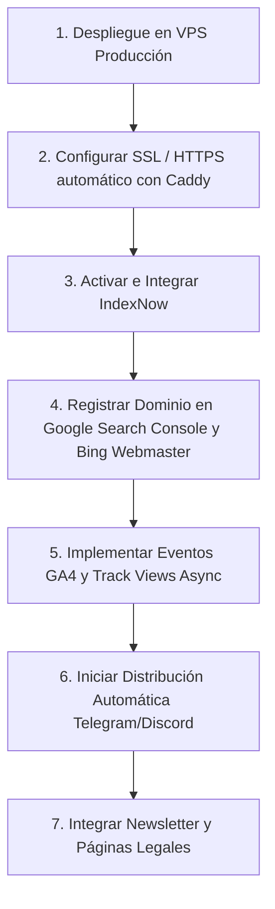

# 📈 Glodaxia — Análisis Detallado de los Avances del Proyecto

Este documento presenta un análisis consolidado del estado actual del proyecto **Glodaxia** (Plataforma de Noticias Automatizadas con IA) para guiar las futuras fases de desarrollo, despliegue y optimización.

---

## 1. 👁️ Visión y Resumen del Proyecto

**Glodaxia** es una plataforma de noticias hiper-especializada en el nicho de **IA y Automatización (Tech News)**. Está diseñada con una arquitectura moderna en **Laravel 13** y **Filament v5** que procesa fuentes RSS, las analiza y redacta artículos bilingües (Inglés/Español) humanizados y optimizados para SEO y accesibilidad (WCAG/ADA), autogenerando también imágenes únicas con IA.

### Stack Tecnológico
*   **Servidor Web/PHP:** FrankenPHP (PHP 8.3) con soporte nativo de HTTP/3 y Caddy.
*   **Framework:** Laravel 13 + Livewire v4.
*   **Base de Datos:** PostgreSQL 17 + `pgvector` (para embeddings y similitud semántica).
*   **Caché y Colas:** Redis 7 + Laravel Horizon.
*   **Tiempo Real:** Laravel Reverb (WebSockets nativos).
*   **Almacenamiento de Media:** Cloudflare R2 (compatible con S3, coste de salida $0).
*   **Administración:** Filament v5 (Arquitectura basada en `Schemas` y layout responsive).
*   **Frontend:** Blade + Alpine.js + Tailwind CSS + Vite 6.

---

## 2. 🏆 Logros y Avances Implementados (Fases 1-3 Completadas)

El proyecto cuenta con bases sólidas y componentes funcionales. Aquí se detallan los avances agrupados por módulo técnico:

### A. Motor de Ingesta y Pipeline de IA (El "Cerebro")
1.  **Ingesta RSS Funcional:** Conexión con feeds RSS a través de `vedmant/laravel-feed-reader`. Se han configurado campos de fiabilidad como `trusted` y tiempos máximos de antigüedad (`max_age_days`).
2.  **Pipeline de Procesamiento con IA (`ProcessArticleWithAIJob.php`):**
    *   **Clasificación semántica** mediante OpenRouter (usando **DeepSeek V4 Pro** como modelo de razonamiento activo).
    *   **Detección de duplicados** en 3 niveles: Hash exacto de título/URL $\rightarrow$ Similitud de texto (TF-IDF/Cosine Similarity) $\rightarrow$ IA Semántica con embeddings `pgvector` en base de datos.
    *   **Generación de Noticias Actualizadas ("Updates"):** Si se detecta un artículo similar pero con nuevos datos, se anexa como una actualización a la noticia original para consolidar la URL y mejorar la señal de frescura ante Google (SEO).
    *   **Redacción Bilingüe (EN/ES):** Generación simultánea para mantener consistencia de hechos en ambos idiomas.
    *   **Robustez contra Alucinaciones de la IA:** El parser de JSON (`parseJson`) filtra y limpia automáticamente bloques `<think>` de razonamiento (característicos de DeepSeek), fences de Markdown, y comas sueltas.
3.  **Generación de Imágenes con IA:**
    *   Llamada optimizada a la API de **SiliconFlow** (modelo **FLUX.1**).
    *   **Spatie MediaLibrary** gestiona la inserción dual por idioma, renombrando los archivos dinámicamente con propósitos SEO (`{slug_en}-{num}.webp` / `{slug_es}-{num}.webp`) e inyectando textos alternativos (Alt Text) para accesibilidad.
    *   **Sistema de Fallback:** En caso de fallar SiliconFlow, el sistema autogenera una imagen con marca (GD library) para evitar enlaces rotos.

### B. SEO Técnico y Distribución
1.  **Sitemaps Dinámicos:** Implementación de un Sitemap Index principal que agrupa 6 sub-sitemaps (artículos en inglés, artículos en español, noticias, imágenes por idioma, etc.).
2.  **IndexNow Integrado:** Controlador (`IndexNowController`) y eventos configurados para notificar de manera inmediata a buscadores como Bing y Yandex cuando se publica o actualiza un artículo.
3.  **Metadatos y JSON-LD:** Inyección automática de esquemas estructurados de Schema.org (`NewsArticle`, `BreadcrumbList`, `ImageObject`) optimizados para Google News.
4.  **Hreflang y Canonical:** Gestión bilingüe robusta con enlaces alternativos cruzados y URLs canónicas.

### C. Backend y Panel de Administración (Filament v5)
1.  **Compatibilidad con Filament v5:** Migración exitosa del sistema a la última API de Filament, implementando la capa unificada de `Schemas` para formularios y vistas de detalle, y layouts adaptativos mediante Container Queries (breakpoints `@md` / `@xl`).
2.  **Workflow Editorial:** Estado del artículo (`draft`, `pending_review`, `published`, `rejected`). Notificaciones por correo electrónico automáticas al cambiar el estado del artículo.
3.  **Dashboard con Widgets:** Indicadores clave de rendimiento y tabla de revisión de borradores pendientes para los editores.
4.  **Optimización de Archivos Huérfanos:** Comandos como `CleanupOrphanMedia` que eliminan de forma segura imágenes descartadas tanto a nivel local como en Cloudflare R2.

### D. Frontend y UI/UX
1.  **Diseño Bilingüe Limpio:** Distribución en 2 columnas (70% feed principal / 30% sidebar para trending topics, newsletter y widgets).
2.  **Compatibilidad Dark/Light:** Configuración avanzada de Tailwind con variantes específicas de tipografía y contraste adaptado a las pautas de accesibilidad WCAG AA (contraste mínimo 4.5:1).
3.  **Social Sharing y Componentes UI:** Componentes para compartir en redes sociales y toggle dinámico de tema con persistencia en `localStorage`.

---

## 3. 🗺️ Próximas Acciones Inmediatas y Hoja de Ruta

Para continuar el desarrollo, la prioridad es mover el proyecto a un entorno real y activar los canales de adquisición orgánicos:

### 🔴 Semana 1: Despliegue e Indexación (Prioridad Alta)
1.  **Montaje en VPS (Hetzner CX22 / DigitalOcean):**
    *   Preparar el entorno Docker con el archivo `docker-compose.yml` provisto.
    *   Configurar el archivo `.env` de producción desactivando debug y asignando `MEDIA_DISK=r2` para producción.
    *   Verificar que FrankenPHP gestione correctamente los certificados HTTPS automáticos (Caddy).
2.  **Configurar IndexNow:** Generar la clave con `openssl rand -hex 16` y levantar el endpoint de verificación en `public/{key}.txt`.
3.  **Google Search Console & Bing Webmaster Tools:** Dar de alta el dominio y subir el sitemap dinámico (`/sitemap.xml`).
4.  **Google Analytics 4 (GA4):** Registrar el código de seguimiento en la plantilla principal `app.blade.php`.

### 🟡 Semanas 2-4: Consolidación de Contenido e Ingesta RSS
1.  **Scheduler RSS Automático:** Habilitar el scheduler en producción para que consulte las fuentes RSS en segundo plano cada 5 minutos (usando Horizon workers).
2.  **Ampliar Fuentes RSS:** Pasar de 4 fuentes actuales a un listado de **8-10 fuentes confiables** especializadas en Inteligencia Artificial.
3.  **Optimizar el Widget de Revisión:** Añadir limpieza de caché (`flushCache()`) y ping automático a IndexNow al aprobar artículos desde la vista de Filament.

### 🟢 Mes 2: Analítica y Engagement
1.  **Rendimiento Asíncrono de Vistas:** Implementar `TrackArticleViewJob` para registrar vistas en la base de datos de forma asíncrona mediante Redis, previniendo cuellos de botella por tráfico concurrente.
2.  **Feedback Loop de Prompts:** Crear la tabla `article_edits` para registrar las correcciones manuales que hagan los editores en Filament. Esto nos servirá para ajustar y pulir el prompt base del redactor de IA.
3.  **Redes Sociales:** Conectar bots de Telegram y webhooks de Discord para publicar automáticamente las noticias aprobadas.

### 🔵 Mes 3: Google News y Newsletter
1.  **Postulación a Google News:** Una vez alcanzados los 50+ artículos y un mes de indexación, postular el sitio a través del Google Publisher Center.
2.  **Newsletter Semanal:** Desarrollar el sistema de suscriptores con doble opt-in y envío automático de resúmenes semanales.
3.  **Páginas Legales:** Redactar y publicar los términos de servicio, política de privacidad, cookies y DMCA.

---

## 4. ⚠️ Puntos de Atención para el Desarrollo Continuo

Al continuar programando en la plataforma, ten en cuenta las siguientes directrices y mejores prácticas del proyecto:

1.  **Evitar Alucinaciones de Estructura en Filament v5:**
    *   Recuerda que en v5 los formularios y los infolists usan `Filament\Schemas\Schema` en lugar de `Form`/`Infolist`. El método es `components([...])` y no `schema([...])`.
    *   No usar llamadas a base de datos pesadas en los schemas; utiliza carga diferida (`lazy()`) o renderizado parcial.
2.  **Optimización del Pipeline de IA:**
    *   Los tiempos de procesamiento de DeepSeek pueden ser largos (de 3 a 5 minutos debido a la fase de razonamiento). Por ello, el `ProcessArticleWithAIJob` tiene configurado un `$timeout` de 600 segundos y reintentos con backoff dinámico.
    *   Al modificar los prompts de redacción, asegúrate de mantener las 9 correcciones del parser JSON (evitar trailing commas, forzar primera persona, añadir anécdotas, validar fechas futuras, etc.).
3.  **Manejo de Assets en Cloudflare R2:**
    *   Todas las subidas deben usar la abstracción de Spatie MediaLibrary. Al borrar un artículo, el observer debe detonar el Job de purga en R2 (`PurgeR2CacheJob`) para no acumular costos innecesarios de almacenamiento.
