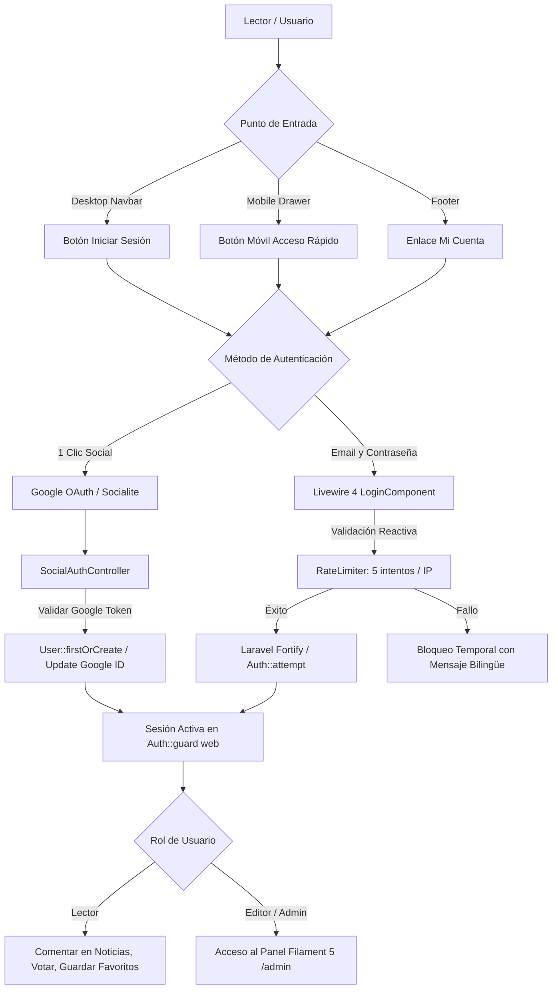

# 🔐 Guía Maestra de Autenticación: Glodaxia Auth System

> **Versión:** 1.0 (Actualizado Agosto 2026)  
> **Stack Oficial:** Laravel 13 · Filament 5 · Livewire 4 · Laravel Fortify (Headless) · Laravel Socialite · Mcamara LaravelLocalization · Tailwind CSS

---

## 🏛️ 1. Filosofía Arquitectónica y Principios

En **Glodaxia**, la autenticación de lectores y administradores se diseñó bajo tres pilares fundamentales:

1. **Zero Bloat & Zero Overwrite (Headless):** En lugar de usar paquetes con plantillas rígidas (como Laravel Breeze), utilizamos **Laravel Fortify** de forma *headless* (`'views' => false`). Fortify gestiona exclusivamente la seguridad backend (hashing de contraseñas, throttling, recuperación por correo y ciclo de sesiones).
2. **Experiencia Reactiva Nativa (Livewire 4):** La interfaz gráfica está construida con componentes reactivos de **Livewire 4**, adaptados al diseño visual *dark mode*, paleta de colores cian/azul y tipografía corporativa de Glodaxia.
3. **Cero Fricción para Lectores (Google OAuth):** Integración con **Laravel Socialite** para permitir el acceso en 1 clic ("Continuar con Google"), obteniendo automáticamente el avatar oficial y el nombre verificado del lector.

---

## 📊 2. Diagrama de Arquitectura y Flujo



---

## 🗄️ 3. Base de Datos y Modelo `User`

### Modificaciones en la Tabla `users` (PostgreSQL)
- **`name` (`jsonb`):** Soporta nombres bilingües `{"es": "...", "en": "..."}` mediante `spatie/laravel-translatable`.
- **`email` (`varchar(255)`):** Único en la base de datos.
- **`google_id` (`varchar(255)`, `nullable`, `unique`):** Identificador OAuth devuelto por Google.
- **`avatar_url` (`varchar(255)`, `nullable`):** URL del avatar oficial de Google o imagen subida convertida a `.webp`.
- **`password` (`varchar(255)`, `nullable`):** Opcional para usuarios que se registran exclusivamente mediante Google OAuth.
- **`slug` (`varchar(255)`, `unique`):** Identificador amigable para autores y lectores (`luis-figuera`, `demo-reader-x1a2`).
- **`is_active` (`boolean`):** Estado de activación de la cuenta.

---

## 🌐 4. Matriz de Rutas Bilingües (i18n)

Todas las rutas públicas de autenticación se gestionan con `Mcamara\LaravelLocalization`:

| Finalidad | Ruta en Español (Locale `es`) | Ruta en Inglés (Default `/`) | Componente / Controlador |
|---|---|---|---|
| **Iniciar Sesión** | `/es/login` | `/login` | `App\Livewire\Auth\LoginComponent` |
| **Crear Cuenta** | `/es/register` | `/register` | `App\Livewire\Auth\RegisterComponent` |
| **Recuperar Contraseña** | `/es/forgot-password` | `/forgot-password` | `App\Livewire\Auth\ForgotPasswordComponent` |
| **Restablecer Clave** | `/es/reset-password/{token}` | `/reset-password/{token}` | `App\Livewire\Auth\ResetPasswordComponent` |
| **Google Redirect** | `/auth/google` | `/auth/google` | `SocialAuthController@redirectToGoogle` |
| **Google Callback** | `/auth/google/callback` | `/auth/google/callback` | `SocialAuthController@handleGoogleCallback` |
| **Cerrar Sesión** | `POST /es/logout` | `POST /logout` | Closure con `Auth::logout()` y CSRF |

---

## ⚡ 5. Componentes Reactivos de Livewire 4

### 1. `LoginComponent`
- **Ruta:** [`app/Livewire/Auth/LoginComponent.php`](file:///Ubuntu-26.04/home/luisf/news/app/Livewire/Auth/LoginComponent.php)
- **Vista:** [`resources/views/livewire/auth/login-component.blade.php`](file:///Ubuntu-26.04/home/luisf/news/resources/views/livewire/auth/login-component.blade.php)
- **Características:**
  - Protección de fuerza bruta: Límite de 5 intentos fallidos por IP antes de bloqueo temporal.
  - Botón de Google OAuth de 1 clic.
  - Opción de "Recordarme por 30 días".
  - Feedback visual animado de carga con SVG spinner.

### 2. `RegisterComponent`
- **Ruta:** [`app/Livewire/Auth/RegisterComponent.php`](file:///Ubuntu-26.04/home/luisf/news/app/Livewire/Auth/RegisterComponent.php)
- **Vista:** [`resources/views/livewire/auth/register-component.blade.php`](file:///Ubuntu-26.04/home/luisf/news/resources/views/livewire/auth/register-component.blade.php)
- **Características:**
  - Validación de contraseña con confirmación (mínimo 8 caracteres).
  - Casilla obligatoria de aceptación de Términos de Servicio y Política de Privacidad con enlaces directos.
  - Invocación de `CreateNewUser` Action de Fortify.

### 3. `ForgotPasswordComponent` & `ResetPasswordComponent`
- **Rutas:** [`app/Livewire/Auth/ForgotPasswordComponent.php`](file:///Ubuntu-26.04/home/luisf/news/app/Livewire/Auth/ForgotPasswordComponent.php) y [`app/Livewire/Auth/ResetPasswordComponent.php`](file:///Ubuntu-26.04/home/luisf/news/app/Livewire/Auth/ResetPasswordComponent.php)
- **Características:**
  - Envío y validación de tokens de recuperación de contraseñas de Laravel mediante `Password::sendResetLink()` y `Password::reset()`.

---


---

## ✉️ 5. Flujo de Registro con Verificación por Correo (Double Opt-In + Auto-Login)

Para garantizar la autenticidad de los lectores y proteger la plataforma contra spam o correos falsos:

1. **Registro:** El lector llena el formulario de registro (`/register`).
2. **Creación con Estado Pendiente:** La cuenta se crea con `email_verified_at = null` y el usuario permanece **cerrado (Logged Out)**.
3. **Despacho del Enlace Firmado:** Se dispara el evento `Registered`, enviando una notificación con una URL firmada criptográficamente (`/email/verify/{id}/{hash}?expires=...&signature=...`) a su correo (capturado en Mailpit en entorno local).
4. **Pantalla de Espera Reactiva:** El formulario muestra una pantalla informativa indicando al usuario que revise su bandeja de entrada con opción de reenviar el enlace.
5. **Verificación e Inicio de Sesión en 1 Clic:** Al hacer clic en el botón de su correo:
   - Laravel valida la firma digital.
   - Marca la cuenta como verificada (`email_verified_at = now()`).
   - **Inicia sesión automáticamente (`Auth::login($user, true)`)**.
   - Redirige al lector al inicio con un mensaje de bienvenida.
6. **Protección en el Login:** Si un usuario no verificado intenta ingresar por el formulario de login tradicional, el sistema bloquea el acceso y le ofrece un botón directo para reenviar su enlace de confirmación.

## 🛠️ 6. Configuración de Google OAuth (Producción y Mock Local)

### Variables en `.env` para Producción
```env
GOOGLE_CLIENT_ID=tu_client_id.apps.googleusercontent.com
GOOGLE_CLIENT_SECRET=tu_client_secret
GOOGLE_REDIRECT_URI="${APP_URL}/auth/google/callback"
```

### ⚡ Modo Mock Local Automático
Si las variables de Google no están definidas en `.env`, el controlador activa el modo simulación para desarrollo:
- Inicia sesión automáticamente con el usuario demo `reader.demo@glodaxia.com`.
- Permite a los desarrolladores probar el flujo de lectores autenticados sin necesidad de configurar credenciales en Google Cloud Console.

---

## 📱 7. Puntos de Entrada en la Interfaz (UI)

1. **Desktop Navbar:**
   - **No autenticado:** Botón cian *"Iniciar Sesión"* / *"Sign In"*.
   - **Autenticado:** Avatar circular con menú desplegable (Nombre, Email, Enlace a `/admin` si aplica, y Botón de Cerrar Sesión).
2. **Mobile Navigation Drawer:**
   - **No autenticado:** Botones de *"Iniciar Sesión"* y *"Crea una cuenta"*.
   - **Autenticado:** Tarjeta con avatar, correo y botón de desconexión.
3. **Footer:**
   - Enlace permanente en la sección legal y de cuenta (`🔑 Iniciar Sesión` / `👤 Mi Cuenta`).

---

## 🧪 8. Verificación y Pruebas Automatizadas

Para validar que los 4 componentes de Livewire 4 renderizan sin errores:
```bash
docker compose exec app php artisan test --filter=Auth
```
O mediante prueba rápida de Livewire:
```php
Livewire::test(\App\Livewire\Auth\LoginComponent::class)->assertStatus(200);
Livewire::test(\App\Livewire\Auth\RegisterComponent::class)->assertStatus(200);
Livewire::test(\App\Livewire\Auth\ForgotPasswordComponent::class)->assertStatus(200);
Livewire::test(\App\Livewire\Auth\ResetPasswordComponent::class, ['token' => 'test'])->assertStatus(200);
```