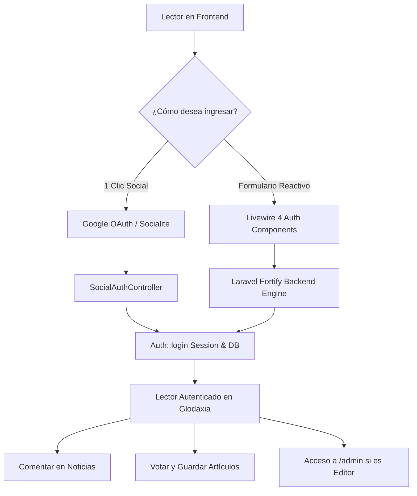

# 🔐 Sistema de Autenticación de Glodaxia (Fortify + Livewire 4 + Socialite)

> **Stack Oficial:**
> - **Laravel Fortify** (Motor Backend Headless: seguridad, hashing, rate limiting, tokens, 2FA).
> - **Livewire 4 + Tailwind CSS** (Frontend UI: Dark mode nativo, reactividad instantánea, sin recargas).
> - **Laravel Socialite** (OAuth2 Social Login con Google / GitHub en 1 clic).
> - **Mcamara LaravelLocalization** (Rutas y traducciones bilingües `/es/login`, `/en/login`).
> - **Filament 5** (Panel de administración seguro en `/admin/login`).

---

## 🏛️ 1. Arquitectura del Sistema



---

## 🚀 2. Componentes y Rutas Bilingües

### Rutas Registradas
| Idioma | Iniciar Sesión | Crear Cuenta | Recuperar Contraseña | Restablecer Contraseña |
|---|---|---|---|---|
| **Español** | `/es/login` | `/es/register` | `/es/forgot-password` | `/es/reset-password/{token}` |
| **English** | `/login` | `/register` | `/forgot-password` | `/reset-password/{token}` |
| **Social** | `/auth/google` | `/auth/google/callback` | — | — |

### Componentes Livewire 4
1. **`App\Livewire\Auth\LoginComponent`**:
   - Throttling con `RateLimiter` (bloqueo tras 5 intentos fallidos).
   - Botón *"Continuar con Google"* integrado.
   - Opción *"Recordarme por 30 días"*.
2. **`App\Livewire\Auth\RegisterComponent`**:
   - Integración con `CreateNewUser` Action de Fortify.
   - Guardado automático de nombre bilingüe en JSONB (`name->en`, `name->es`) y generación de slug único.
   - Validación de aceptación de Términos y Privacidad.
3. **`App\Livewire\Auth\ForgotPasswordComponent`**:
   - Envío seguro de enlaces con tokens firmados de Laravel.
4. **`App\Livewire\Auth\ResetPasswordComponent`**:
   - Restablecimiento de contraseña con `ResetUserPassword` Action.

---

## 🛡️ 3. Social Login (Google OAuth)

Configuración en `.env`:
```env
GOOGLE_CLIENT_ID=tu_google_client_id
GOOGLE_CLIENT_SECRET=tu_google_client_secret
GOOGLE_REDIRECT_URI="${APP_URL}/auth/google/callback"
```

> **⚡ Mock en Entorno Local:** Si las variables `GOOGLE_CLIENT_ID` no están configuradas en `.env`, el sistema entra en modo desarrollo seguro (`mock_google_123456`), permitiendo probar el flujo de lectores de forma instantánea sin necesidad de credenciales de Google Cloud.

---

## 🎨 4. Integración en Navbar y Experiencia de Usuario

- **Visitante Anónimo:** Muestra el botón de acceso rápido con acento cian (*"Iniciar Sesión"* / *"Sign In"*).
- **Usuario Autenticado:** Muestra un botón con el avatar de Google o las iniciales del usuario, desplegando un menú con:
  - Nombre y correo del lector.
  - Enlace al **Panel de Administración** (`/admin`) si el usuario tiene rol administrativo.
  - Botón de **Cerrar Sesión** seguro con token CSRF.