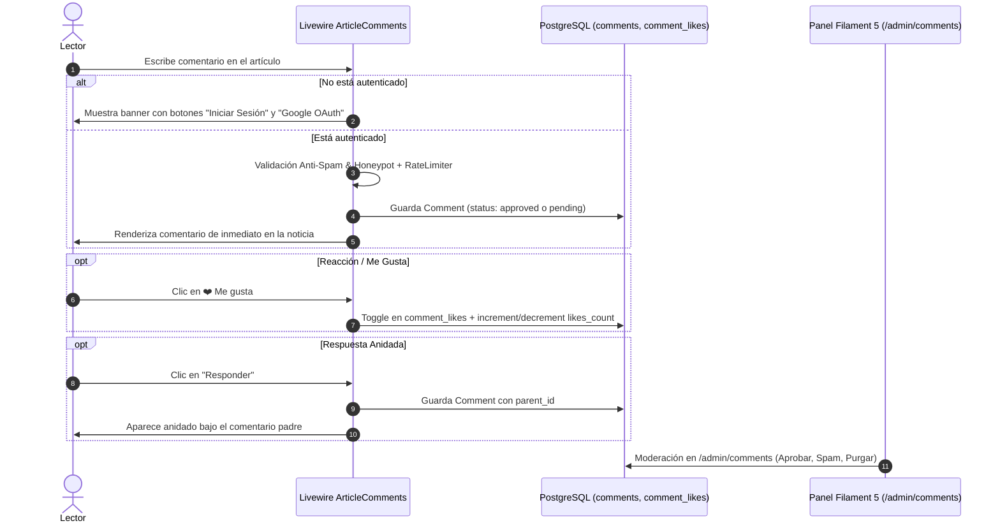

# 💬 Guía Maestra del Sistema de Comentarios: Glodaxia Comments Engine

> **Versión:** 1.0 (Agosto 2026)  
> **Stack Oficial:** Laravel 13 · Filament 5 · Livewire 4 · PostgreSQL · Tailwind CSS · Mcamara LaravelLocalization

---

## 🏛️ 1. Arquitectura y Filosofía

El sistema de comentarios de **Glodaxia** está construido de forma 100% nativa para ofrecer la máxima velocidad, SEO y privacidad:

1. **Autenticación Requerida:** Para comentar, reaccionar con "Me gusta" o responder hilos, el usuario debe estar registrado y con correo verificado (o mediante Google OAuth 1-Click).
2. **Hilos Anidados (Nested Replies):** Estructura jerárquica tipo Reddit/YouTube con soporte para respuestas directas a cualquier comentario mediante `parent_id`.
3. **Reacciones Reactivas (Likes):** Contador de me gusta con alternancia en tiempo real mediante `CommentLike` (evitando votos duplicados).
4. **Moderación y Anti-Spam en Filament 5:** Pestañas de moderación (*Pendientes, Aprobados, Spam*), acciones en lote y filtro de seguridad con Honeypot.

---

## 📊 2. Diagrama de Flujo



---

## 🗄️ 3. Estructura de Base de Datos

### Tabla `comments`
- `id` (bigint, PK)
- `article_id` (foreignId -> `articles`, cascade)
- `user_id` (foreignId -> `users`, cascade)
- `parent_id` (foreignId nullable -> `comments`, cascade)
- `content` (text, max 2000 chars)
- `status` (varchar 20: `approved`, `pending`, `spam`, `rejected`)
- `likes_count` (unsignedInteger, default 0)
- `ip_address` (varchar 45, nullable)
- `user_agent` (text, nullable)
- `created_at`, `updated_at`, `deleted_at` (SoftDeletes)

### Tabla `comment_likes`
- `id` (bigint, PK)
- `comment_id` (foreignId -> `comments`, cascade)
- `user_id` (foreignId -> `users`, cascade)
- Índice único `['comment_id', 'user_id']` para evitar likes duplicados.

---

## ⚡ 4. Componente Reactivo Livewire 4

- **Clase:** [`app/Livewire/ArticleComments.php`](file:///Ubuntu-26.04/home/luisf/news/app/Livewire/ArticleComments.php)
- **Vista Blade:** [`resources/views/livewire/article-comments.blade.php`](file:///Ubuntu-26.04/home/luisf/news/resources/views/livewire/article-comments.blade.php)

### Métodos Principales:
- `postComment()`: Valida sesión, longitud, Honeypot y RateLimiter; publica comentario raíz.
- `startReply($commentId)`: Abre la caja de respuesta bajo el comentario seleccionado.
- `postReply($parentId)`: Guarda la respuesta anidada vinculada a `parent_id`.
- `toggleLike($commentId)`: Alterna el like del lector autenticado.
- `deleteComment($commentId)`: Permite al autor del comentario o al administrador borrarlo.
- `loadMore()`: Paginación infinita de 10 en 10 comentarios sin recargar la página.

---

## ⚙️ 5. Panel de Moderación en Filament 5

- **Clase Resource:** [`app/Filament/Resources/CommentResource.php`](file:///Ubuntu-26.04/home/luisf/news/app/Filament/Resources/CommentResource.php)
- **Página de Listado:** [`app/Filament/Resources/CommentResource/Pages/ListComments.php`](file:///Ubuntu-26.04/home/luisf/news/app/Filament/Resources/CommentResource/Pages/ListComments.php)

### Pestañas Disponibles:
1. **All Comments:** Lista completa de comentarios.
2. **Pending Moderation:** Muestra un badge de alerta con el número de comentarios en espera.
3. **Approved:** Comentarios visibles en el sitio público.
4. **Spam:** Comentarios bloqueados o sospechosos.

### Acciones Masivas (Bulk Actions):
- `Aprobar seleccionados`: Activa los comentarios en 1 clic.
- `Marcar como Spam`: Pasa a estado spam y oculta de las noticias.
- `Eliminar`: Borrado permanente o suave.

---

## 🧪 6. Pruebas Automatizadas

Para validar el sistema completo de comentarios:
```bash
docker compose exec app php artisan test --filter=Comment
```