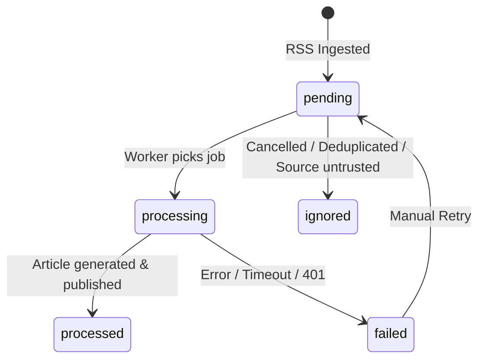

# 🛑 Guía de Control de Ingesta, Colas y Cancelación de Noticias con IA

Esta guía documenta los mecanismos operativos para **pausar, reanudar, monitorear y cancelar de emergencia** todas las generaciones de noticias en cola y descargas RSS en **Glodaxia**.

---

## 📑 Tabla de Contenidos
1. [Resumen Rápido](#resumen-rápido)
2. [Cómo Cancelar Noticias en Cola](#1-cómo-cancelar-noticias-en-cola)
   - [Método A: Desde Filament Admin (Web)](#método-a-desde-el-panel-web-filament)
   - [Método B: Desde la Terminal (Artisan CLI)](#método-b-desde-la-terminal-artisan-cli)
3. [Interruptor Maestro de Ingesta (Pausar / Reanudar RSS)](#2-interruptor-maestro-de-ingesta)
4. [Ciclo de Vida y Estados de Noticias Crudas (`RawArticle`)](#3-ciclo-de-vida-y-estados-de-noticias-crudas)
5. [Comandos de Diagnóstico y Monitoreo](#4-comandos-de-diagnóstico-y-monitoreo)
6. [Resolución de Problemas Frecuentes](#5-resolución-de-problemas-frecuentes)

---

## ⚡ Resumen Rápido

| Acción | Comando de Terminal | Ubicación en Panel Web |
|---|---|---|
| **Cancelar todo en cola** | `php artisan ingestion:cancel-all` | `/admin/raw-articles` → Botón *"Cancelar Todo en Cola"* |
| **Cancelar y eliminar crudas** | `php artisan ingestion:cancel-all --delete` | Terminal |
| **Pausar Ingesta RSS** | `php artisan ingestion:control pause` | `/admin/sources` → Botón *"Pausar Ingesta"* |
| **Reanudar Ingesta RSS** | `php artisan ingestion:control resume` | `/admin/sources` → Botón *"Reanudar Ingesta"* |
| **Ver estado del Interruptor** | `php artisan ingestion:control status` | Widget en `/admin/sources` |

---

## 1. Cómo Cancelar Noticias en Cola

Cuando se descargan muchas noticias crudas por RSS y deseas frenar el procesamiento para no consumir saldo de IA (OpenRouter) o limpiar la cola de trabajo:

### Método A: Desde el Panel Web (Filament)
1. Inicia sesión en el panel de administración: [http://localhost:8000/admin](http://localhost:8000/admin).
2. Ve a la sección **Artículos Crudos** ([`/admin/raw-articles`](http://localhost:8000/admin/raw-articles)).
3. En la esquina superior derecha verás el botón rojo **`Cancelar Todo en Cola`** (icono 🚫).
4. Pulsa el botón y confirma en la ventana modal:
   - Elimina todos los trabajos pendientes de la tabla `jobs`.
   - Purga el historial de trabajos fallidos de `failed_jobs`.
   - Marca todas las noticias crudas pendientes (`pending`) y en curso (`processing`) como **`Ignoradas` (`ignored`)**, impidiendo que los workers las procesen.

---

### Método B: Desde la Terminal (Artisan CLI)

#### 1. Cancelar y marcar como ignoradas (Recomendado):
Conserva el registro histórico de la noticia cruda pero impide su redacción con IA:
```bash
docker compose exec app php artisan ingestion:cancel-all
# O directamente si estás dentro del contenedor / entorno local:
php artisan ingestion:cancel-all
```

#### 2. Cancelar y eliminar permanentemente:
Borra los registros de `raw_articles` pendientes de la base de datos:
```bash
docker compose exec app php artisan ingestion:cancel-all --delete
```

---

## 2. Interruptor Maestro de Ingesta

El **Interruptor Maestro (Master Ingestion Switch)** controla si el comando de descarga RSS (`php artisan rss:fetch`) debe conectarse a las fuentes o suspender la recolección.

### A. Control desde la Terminal:
```bash
# Consultar estado actual (Activo / Pausado)
php artisan ingestion:control status

# Pausar temporalmente la descarga de nuevos RSS
php artisan ingestion:control pause

# Reanudar la descarga de RSS
php artisan ingestion:control resume

# Alternar estado (Toggle)
php artisan ingestion:control toggle
```

### B. Control desde Filament Admin:
- Ve a [http://localhost:8000/admin/sources](http://localhost:8000/admin/sources).
- En la cabecera verás el botón dinámico **`Pausar Ingesta`** / **`Reanudar Ingesta`** con confirmación modal.
- El widget inferior muestra la píldora de estado en vivo (*🟢 Ingesta Activa* / *🔴 Ingesta Pausada*).

---

## 3. Ciclo de Vida y Estados de Noticias Crudas

Cada noticia recopilada de los canales RSS pasa por los siguientes estados en la tabla `raw_articles`:



| Estado | Significado | Comportamiento |
|---|---|---|
| `pending` | **Pendiente** | En cola para ser procesada por `ProcessArticleWithAIJob`. |
| `processing` | **En Proceso** | El worker de Laravel está llamando a OpenRouter y generando imágenes FLUX.1. |
| `processed` | **Procesada** | Noticia redactada con éxito, imagen generada y artículo publicado en la web. |
| `ignored` | **Ignorada** | Cancelada por el usuario, detectada como duplicado, o fuente no confiable. |
| `failed` | **Fallida** | Error de autenticación o timeout irrecuperable. |

---

## 4. Comandos de Diagnóstico y Monitoreo

### Ver el estado de la cola en tiempo real:
```bash
# Ver trabajos pendientes en base de datos
docker compose exec app php artisan queue:monitor default

# Inspeccionar trabajos fallidos
docker compose exec app php artisan queue:failed

# Purgar historial de fallos
docker compose exec app php artisan queue:flush
```

### Reiniciar Workers de Cola:
Si cambias variables en `.env` o código de jobs:
```bash
docker compose exec app php artisan queue:restart
```

---

## 5. Resolución de Problemas Frecuentes

### ❓ ¿Qué pasa con los artículos que ya fueron publicados?
Cancelar la cola **solo afecta a las noticias pendientes o en proceso**. Los artículos ya redactados y publicados en [http://localhost:8000](http://localhost:8000) permanecen intactos.

### ❓ ¿Si cancelo una noticia, volverá a descargarse en el próximo RSS?
No. El sistema de deduplicación de 3 niveles (`DuplicateCheckerService`) recuerda las URLs y hashes ya recibidos para evitar descargar la misma noticia repetida.

### ❓ ¿Cómo reanudo la ingesta después de cancelar?
1. Si pausaste el interruptor maestro, ejecutas: `php artisan ingestion:control resume`.
2. Las nuevas noticias que publiquen los medios a partir de ese momento entrarán con normalidad.