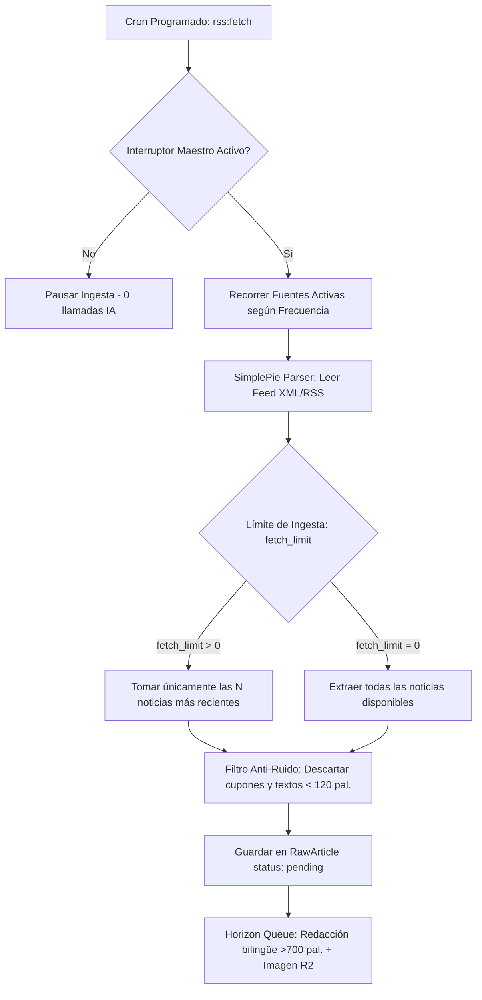

# 📡 Guía Maestra del Sistema de Ingestión y Fuentes RSS

> **Glodaxia Ingestion Engine**  
> **Versión:** 2.0 (Agosto 2026)  
> **Ubicación en Panel:** `/admin/sources` (Grupo: *Ingesta*)

---

## 🏛️ 1. Arquitectura de Ingestión y Control Editorial

El sistema de ingesta de **Glodaxia** está diseñado para extraer noticias de medios internacionales de alta reputación periodística y procesarlas con IA sin saturar la cola ni diluir el *Crawl Budget* de Googlebot.



---

## 📖 2. Glosario de Columnas y Parámetros de Fuentes (`/admin/sources`)

A continuación se detalla el propósito y comportamiento técnico de cada columna en el panel de administración:

| Columna en Tabla | Campo en Formulario | Tipo / Rango | Descripción y Comportamiento |
|---|---|---|---|
| **Nombre** | `name` | Texto | Nombre público o corporativo del medio (ej. *Ars Technica, TechCrunch, Hugging Face*). |
| **URL** | `url` | URL válida | Enlace directo al feed público XML, RSS 2.0 o Atom. |
| **Tipo** | `type` | `rss`, `atom`, `json`, `scraping` | Formato del feed. Generalmente detectado automáticamente. |
| **Límite (Posts)** ⭐ | `fetch_limit` | Entero (`0` o `N >= 1`) | **Control de volumen por escaneo:**<br>• **`0` = Sin Límite:** Extrae todas las noticias disponibles en el feed.<br>• **`N > 0` (ej: 2, 3, 5):** Extrae únicamente las $N$ noticias más recientes, evitando saturar la cola. |
| **Freq (min)** | `frequency` | Minutos (ej. `60`, `120`) | Intervalo mínimo entre consultas automáticas del programador en segundo plano. |
| **Score (Salud)** | `score` | `0 - 100` | Métrica de fiabilidad: **+2** puntos con noticias nuevas, **-5** puntos si el feed falla o da timeout. |
| **Activa** | `is_active` | Toggle (`true` / `false`) | Interruptor individual de 1 clic para activar o pausar un feed sin borrarlo. |
| **Verificada** | `trusted` | Toggle (`true` / `false`) | Identifica fuentes de Élite (Tier 1) con máxima prioridad en la cola de procesamiento. |
| **Default** | `is_default` | Booleano | Marca las fuentes preconfiguradas del núcleo de Glodaxia. |
| **Máx. Días** | `max_age_days` | Días (ej. `1`, `3`) | Filtro de frescura: Rechaza noticias publicadas hace más de $X$ días. |
| **Última Ingesta** | `last_fetched_at` | Timestamp | Fecha y hora exacta en la que se completó el último escaneo exitoso. |

---

## 🎛️ 3. Comandos Útiles por Consola

```bash
# Ejecutar escaneo respetando frecuencias y límites
docker compose exec app php artisan rss:fetch

# Forzar escaneo de todas las fuentes activas inmediatamente
docker compose exec app php artisan rss:fetch --force

# Consultar o alternar el Interruptor Maestro
docker compose exec app php artisan ingestion:control status
docker compose exec app php artisan ingestion:control toggle
```