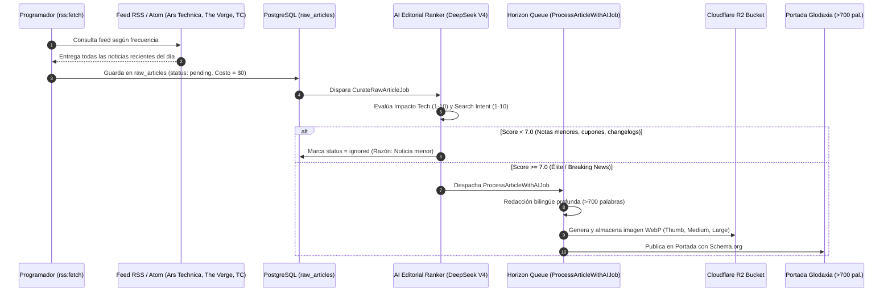

# 📡 Guía Maestra del Sistema de Ingestión y Curaduría con IA

> **Glodaxia Ingestion & AI Editorial Curation Engine**  
> **Versión:** 3.0 (Agosto 2026)  
> **Ubicación en Panel:** `/admin/sources` y `/admin/raw-articles`

---

## 🏛️ 1. Arquitectura en 2 Fases (Two-Stage Pipeline)

Para evitar la pérdida de noticias clave y garantizar que el 100% de los artículos publicados tengan alto impacto y respondan a intenciones reales de búsqueda, el sistema opera en **dos fases desacopladas**:



---

## 📊 2. Criterios de Evaluación del AI Editorial Ranker

Cada noticia cruda es calificada automáticamente por la IA en 3 dimensiones:

1. **Impacto Tecnológico (1-10):** Hardware de próxima generación, modelos fundacionales de IA, vulnerabilidades zero-day críticas, computación cuántica, infraestructura de servidores.
2. **Intención de Búsqueda & Relevancia (1-10):** ¿Es un tema que profesionales, ingenieros y lectores buscarán activamente en Google?
3. **Sustancia Editorial:** Se descartan de forma estricta ofertas de compra, códigos de descuento, cupones y parches rutinarios de una línea.

### Decisiones del Evaluador:
* **`promote` (Score $\ge$ 7.0 / 10):** Pasa de inmediato a redacción completa con imagen.
* **`ignore` (Score $<$ 7.0 / 10):** Queda almacenada en `raw_articles` como historial pero no consume créditos de imagen ni satura la portada.

---

## 🎛️ 3. Control Manual desde Filament 5

1. **En `/admin/sources`:**
   - **Master Switch Global:** Congela o reactiva toda la ingesta del portal.
   - **Toggles Individuales:** Activar o pausar fuentes con 1 clic.
   - **Filtro de Días:** Configurar ventana de frescura (1 a 3 días).
2. **En `/admin/raw-articles`:**
   - Ver el **Score Editorial** y la justificación de la IA para cada noticia.
   - Pestañas organizadas: *Todas, Pendientes, Procesadas, Ignoradas por IA, Fallidas*.
   - Botón **"Forzar Procesamiento IA"** para que el editor humano pueda publicar manualmente cualquier noticia que haya sido descartada si así lo desea.

---

## 🧪 4. Comandos de Consola

```bash
# Ejecutar escaneo de todos los feeds RSS
docker compose exec app php artisan rss:fetch

# Forzar escaneo inmediato sin esperar frecuencias
docker compose exec app php artisan rss:fetch --force

# Consultar o alternar el Interruptor Maestro
docker compose exec app php artisan ingestion:control status
docker compose exec app php artisan ingestion:control toggle
```