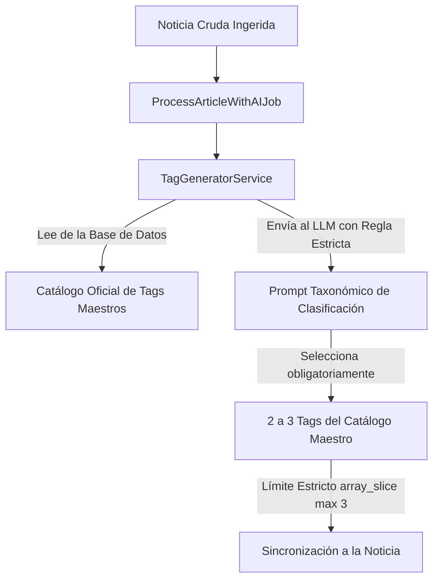

# 🏷️ Estrategia de Taxonomía, Etiquetas (Tags) y Redacción Editorial con IA en Glodaxia

Esta guía documenta los estándares de **SEO Técnico, Arquitectura de Taxonomía Cerrada y Directrices de Redacción de Contenido con IA** implementados en Glodaxia para garantizar autoridad temática (*Topical Authority*), evitar la proliferación de contenido pobre (*Thin Content*) y maximizar el posicionamiento en Google.

---

## 🛑 1. El Problema de la Proliferación de Etiquetas (*Tag Proliferation*)

En muchos portales automatizados con IA ocurre el error de dejar que la IA invente tags libres para cada noticia. Esto genera:
* **Páginas Zombi / Thin Content:** Cientos de URLs de tags con solo 1 artículo, penalizadas por el algoritmo Panda de Google.
* **Desperdicio de Presupuesto de Rastreo (*Crawl Budget*):** Los bots de Google rastrean URLs vacías en lugar de indexar las macro-categorías y noticias nuevas.
* **Canibalización de Palabras Clave:** Múltiples tags redundantes (`ai`, `ia`, `ai-models`, `chatgpt-update`) compitiendo entre sí.

---

## 🏛️ 2. Arquitectura de Taxonomía de Bucle Cerrado (*Closed-Loop Taxonomy*)

Para resolver esto de forma definitiva, Glodaxia implementa una **Taxonomía de Bucle Cerrado**:



### Reglas Clave del Sistema:
1. **Catálogo Maestro Activo:** La IA recibe la lista de tags consolidados existentes en el prompt.
2. **Prioridad Obligatoria:** La IA solo puede seleccionar tags del catálogo existente.
3. **Límite Estricto:** **Máximo 3 tags por artículo** (densidad alta y cero dispersión).
4. **Regla de Admisión para Nuevos Tags:** Solo se permite un tag nuevo si representa una nueva empresa relevante de tecnología (ej. *Mistral AI, DeepSeek, Groq*) o un concepto tecnológico fundamental no listado.

---

## 📋 3. Catálogo Oficial de Tags Maestros (Hubs Temáticos)

| Eje Temático | Tags Maestros Oficiales | Sinónimos / Términos que Consolida |
| :--- | :--- | :--- |
| **Big Tech & Líderes** | `OpenAI`, `Google`, `Meta`, `Microsoft`, `NVIDIA`, `Apple`, `Anthropic`, `Amazon`, `Tesla` | ChatGPT, Sora, Gemini, DeepMind, Llama, Azure, Copilot, Blackwell, H100, Claude, AWS, Elon Musk... |
| **Inteligencia Artificial** | `Artificial Intelligence`, `Large Language Models`, `AI Agents`, `Computer Vision`, `Robotics & Automation`, `Reinforcement Learning`, `AI Ethics & Safety`, `AI Regulation & Policy` | GenAI, LLMs, SLMs, Autonomous Agents, Humanoid Robots, RLHF, AI Safety, EU AI Act, Copyright... |
| **Ciberseguridad & Redes** | `Cybersecurity`, `Vulnerabilities & Exploits`, `Ransomware & Malware`, `Data Privacy & Protection`, `Cloud Computing`, `Digital Infrastructure`, `Hardware & Semiconductors` | Zero-Day, RCE, CVE, Exploit, Phishing, Spyware, GDPR, Encryption, Zero-Trust, Datacenters, TSMC, Chips... |
| **Ingeniería & DevOps** | `Software Engineering`, `DevOps & CI/CD`, `Open Source`, `Databases & Storage`, `Web Development`, `APIs & Microservices` | Docker, Kubernetes, FOSS, GitHub, PostgreSQL, Redis, React, Laravel, Python, Rust, REST API... |
| **Ciencia & Negocios** | `Science & Innovation`, `Startups & Venture Capital`, `E-Commerce & Digital Economy` | Quantum Computing, Biotech, Funding Rounds, IPO, Fintech, Payments, Blockchain... |

---

## ✍️ 4. Directrices de Redacción Editorial con IA (E-E-A-T)

Todas las noticias procesadas por el motor de IA en [`ProcessArticleWithAIJob.php`](file:///Ubuntu-26.04/home/luisf/news/app/Jobs/ProcessArticleWithAIJob.php) cumplen con los siguientes estándares de calidad:

### A. Estructura y Longitud:
* **Extensión:** Entre **600 y 1,200 palabras** por artículo bilingüe (EN / ES).
* **Jerarquía Semántica:** Uso estructurado de encabezados `<h2>` y `<h3>` con palabras clave secundarias.
* **Lead Periodístico:** Primer párrafo directo que responde al *Qué, Quién, Cuándo, Dónde y Por qué*.

### B. Tono y Neutralidad Editorial:
* **Tono Periodístico Serio:** Enfoque técnico y analítico, sin adjetivos sensacionalistas ni clickbait.
* **Prohibición de Clichés de IA:** Se eliminan frases artificiales como *"en conclusión"*, *"en resumen"*, *"en un mundo en constante evolución"*, *"un testimonio de"*.
* **Citación de Fuentes Segura:** Las referencias a fuentes externas se atribuyen de forma editorial (*"según reportes verificados de la industria"*), protegiendo la navegación y evitando enlaces externos rotos.

### C. Contenido Visual Optimizado:
* **Imágenes WebP Responsivas:** Formato `.webp` con `srcset` (400w, 800w, 1280w) alojadas 100% en **Cloudflare R2**.
* **Etiquetado Accesible:** Contenedores `<figure>` con `<figcaption>` descriptivo y atributos `alt` y `title` generados contextualmente.

---

## 🐳 5. Comandos de Mantenimiento (Vía Docker)

```bash
# 🐳 Ejecutar auditoría y recálculo de artículos por cada tag
docker compose exec app php artisan tinker --execute="App\Models\Tag::all()->each(function(\$t){\$t->article_count=\$t->articles()->count();\$t->saveQuietly();});"

# 🐳 Limpiar caché de vistas, rutas y aplicación
docker compose exec app php artisan view:clear && docker compose exec app php artisan route:clear && docker compose exec app php artisan cache:clear

# 🐳 Verificar el listado de tags consolidados
docker compose exec app php artisan tinker --execute="App\Models\Tag::orderByDesc('article_count')->get(['name', 'slug', 'article_count'])->take(15)->dump();"
```