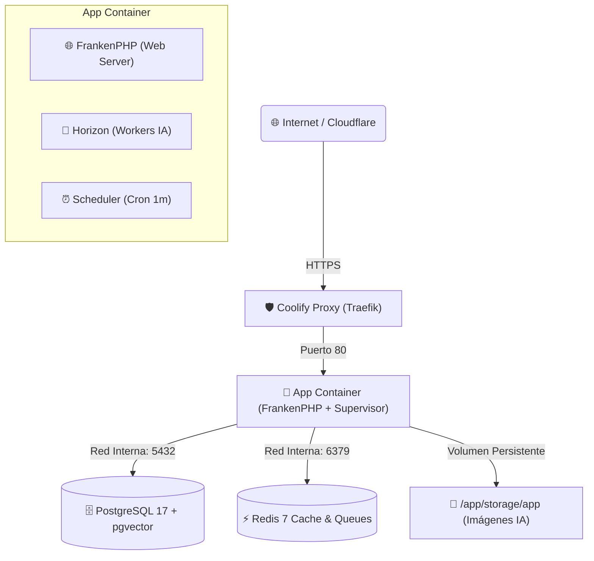

# Guía Definitiva de Despliegue en Coolify v4 (Glodaxia News)

Guía paso a paso, directa al grano y sin rodeos para desplegar con éxito el stack completo de **Glodaxia News** en **Coolify v4** (Laravel 13, FrankenPHP, PostgreSQL 17 + pgvector, Redis 7, Horizon, DeepSeek y FLUX.1).

---

## 🏗️ Arquitectura del Proyecto en Coolify

Para garantizar **cero tiempo de inactividad (Zero-Downtime)**, backups automáticos y seguridad de datos, crearemos **3 recursos independientes** dentro del mismo Proyecto/Entorno en Coolify:

1. **Recurso Database**: PostgreSQL 17 con extensión `pgvector`.
2. **Recurso Database**: Redis 7 (Cache y Colas de IA).
3. **Recurso Application**: Laravel 13 + FrankenPHP (construido desde tu GitHub privado mediante el `Dockerfile` oficial).



---

## ✅ Buenas Prácticas OBLIGATORIAS

1. **Usar siempre Build Pack `Dockerfile` (Nunca Nixpacks)**: El `Dockerfile` incluye las extensiones PHP exactas (`pdo_pgsql`, `redis`, `gd`, `intl`, `pcntl`) y compila los assets de Vite (`npm run build`) durante la construcción.
2. **Declarar el Volumen Persistente de Storage**: Mapear `/app/storage/app` en Coolify para que las imágenes de las noticias no se borren en cada `git push`.
3. **Conectar via Nombres Internos de Docker**: Usar el *Internal Hostname* asignado por Coolify para `DB_HOST` y `REDIS_HOST`.
4. **Activar Backups Automáticos en Coolify**: Programar copias de seguridad diarias de Postgres desde la pestaña *Backups* de Coolify.

---

## ❌ Malas Prácticas a EVITAR

* ❌ **NO uses `DB_HOST=127.0.0.1` ni `localhost`**: En Docker cada contenedor es un host distinto. Usa el nombre interno del recurso en Coolify.
* ❌ **NO uses Nixpacks**: Nixpacks ignorará la librería GD y las imágenes de IA fallarán.
* ❌ **NO dejes `APP_DEBUG=true` en producción**: Expone variables de entorno y reduce el rendimiento.
* ❌ **NO olvides configurar `APP_KEY`**: Debe estar presente en las variables de entorno antes del primer despliegue.

---

## 🛠️ PASO 1: Crear la Base de Datos PostgreSQL en Coolify

1. En tu proyecto de Coolify, haz clic en **+ New Resource** ➔ **Database** ➔ **PostgreSQL**.
2. Configura los campos:
   * **Resource Name**: `glodaxia-postgres`
   * **Docker Image**: `pgvector/pgvector:pg17`
   * **Database Name**: `glodaxia_news`
   * **Username**: `glodaxia_user`
   * **Password**: *(Escribe una contraseña segura)*
3. En **PostgreSQL Settings / Arguments** (o Custom Docker Options):
   ```text
   -c shared_preload_libraries=vector -c max_connections=200
   ```
4. Haz clic en **Deploy**.
5. **Copia el Internal Hostname** que te muestra Coolify (ejemplo: `glodaxia-postgres` o el UUID interno).

---

## ⚡ PASO 2: Crear el Servicio Redis en Coolify

1. En el mismo proyecto, haz clic en **+ New Resource** ➔ **Database** ➔ **Redis**.
2. Configura los campos:
   * **Resource Name**: `glodaxia-redis`
   * **Docker Image**: `redis:7-alpine`
   * **Password**: *(Opcional o dejar en blanco)*
3. Haz clic en **Deploy**.
4. **Copia el Internal Hostname** (ejemplo: `glodaxia-redis`).

---

## 🚀 PASO 3: Crear y Configurar la Aplicación Laravel

1. Haz clic en **+ New Resource** ➔ **Public/Private Git Repository**.
2. Selecciona tu repositorio de GitHub privado y la rama `master` (o `main`).
3. **Build Pack**: Selecciona estrictamente **Dockerfile**.
4. **General Settings**:
   * **Resource Name**: `glodaxia-app`
   * **Domains (FQDN)**: `https://glodaxia.com, https://www.glodaxia.com`
   * **Port Expose**: `80`

---

## 💾 PASO 4: Configurar el Volumen Persistente (Imágenes)

En la configuración de la App en Coolify:
1. Ve a la pestaña **Storages** (o *Persistent Storage*).
2. Haz clic en **+ Add Storage**:
   * **Volume Name**: `glodaxia_storage`
   * **Mount Path**: `/app/storage/app`
3. Guarda los cambios.

> [!IMPORTANT]
> Con este volumen, todas las imágenes generadas por la IA y conversiones WebP quedarán guardadas en el disco del servidor y NUNCA se borrarán al hacer nuevos despliegues.

---

## 🔑 PASO 5: Variables de Entorno (Environment Variables)

En la pestaña **Environment Variables** de la App en Coolify, pega la siguiente configuración (ajusta las claves con tus datos reales):

```dotenv
APP_NAME="Glodaxia News"
APP_ENV=production
APP_KEY=base64:GENERA_TU_KEY_CON_PHP_ARTISAN_KEY_GENERATE
APP_DEBUG=false
APP_URL=https://glodaxia.com
ASSET_URL=https://glodaxia.com

LOG_CHANNEL=daily
LOG_LEVEL=error

# --- CONEXIÓN A POSTGRESQL (Usar nombre interno del recurso) ---
DB_CONNECTION=pgsql
DB_HOST=dkkc8004sks44w8s8kk4soso
DB_PORT=5432
DB_DATABASE=postgres
DB_USERNAME=postgres
DB_PASSWORD=EX8yqyx4jBpds5PkXPacMjAt8h9GkecpKA7ikM91oddwUU6A98tzq0ftFSWSYtkM

# --- CONEXIÓN A REDIS (Usar nombre interno del recurso) ---
REDIS_HOST=ngso04k040g08ocggg4wsws4
REDIS_PASSWORD=uXvERZI3cTnYIHZeM6jlEug0ZIGxZv72Bx7ThrV6HNJG91q9Ix55LIVWzptNIXnu
REDIS_PORT=6379

CACHE_STORE=redis
SESSION_DRIVER=redis
QUEUE_CONNECTION=redis

# --- APIS DE INTELIGENCIA ARTIFICIAL ---
DEEPSEEK_API_KEY=sk-tu-clave-de-deepseek
SILICONFLOW_API_KEY=sk-tu-clave-de-siliconflow
SILICONFLOW_IMAGE_MODEL=black-forest-labs/FLUX.1-schnell

# --- INDEXNOW (Bing, Yandex, Copilot, ChatGPT Search) ---
INDEXNOW_KEY=e9a4f781c03d42bfa168925bc01e4a77

# --- CONFIGURACIÓN DE CORREO (Resend / Mailgun / Postmark) ---
MAIL_MAILER=smtp
MAIL_HOST=smtp.resend.com
MAIL_PORT=465
MAIL_USERNAME=resend
MAIL_PASSWORD=re_tu_api_key
MAIL_ENCRYPTION=tls
MAIL_FROM_ADDRESS="noticias@glodaxia.com"
MAIL_FROM_NAME="Glodaxia News"
```

---

## 🚀 PASO 6: Desplegar y Verificar

1. Haz clic en el botón **Deploy** en la esquina superior derecha de Coolify.
2. Coolify ejecutará el build con el `Dockerfile`:
   * Compilará los assets de Vite en producción.
   * Instalará Composer optimizado.
   * El script `entrypoint.sh` esperará a la base de datos, ejecutará `migrate --force`, creará el symlink de storage y levantará FrankenPHP y Supervisor.

---

## 🧪 PASO 7: Inicialización del Primer Usuario Administrador

Una vez completado el despliegue:
1. En Coolify, ve al recurso **glodaxia-app** ➔ pestaña **Terminal** (o *Execute Command*).
2. Ejecuta el seeder para crear las categorías, tags y roles iniciales:
   ```bash
   php artisan db:seed
   ```
3. Crea tu usuario Super Admin para el panel Filament:
   ```bash
   php artisan make:filament-user
   ```
4. Accede a tu panel en: `https://glodaxia.com/admin`

---

## 📡 PASO 8: Verificación de IndexNow y Google

1. **Verificar IndexNow**: Comprueba que el endpoint de verificación responde tu clave:
   ```bash
   curl -I https://glodaxia.com/indexnow?key=e9a4f781c03d42bfa168925bc01e4a77
   ```
2. **Google Search Console**: Añade la propiedad `https://glodaxia.com` y envía el sitemap `https://glodaxia.com/sitemap.xml`.
3. **Google News Publisher Center**: Registra el feed `https://glodaxia.com/feed.xml`.

---

## ✨ ¿Qué pasa después en cada `git push`?

Cada vez que hagas un `git push origin master`:
* Coolify detectará el cambio automáticamente.
* Reconstruirá la imagen de la App con el nuevo código.
* Tu base de datos PostgreSQL y Redis **no se reiniciarán ni se interrumpirán**.
* Las imágenes guardadas en el volumen **permanecerán intactas**.
* Las migraciones nuevas se ejecutarán solas.
* El despliegue tardará menos de 1 minuto.
