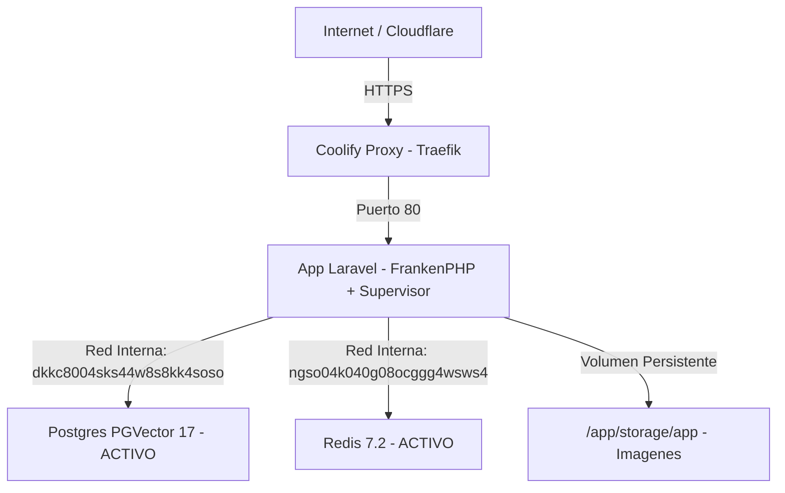

# Guia Definitiva de Despliegue en Coolify v4 (Glodaxia News)

Guia maestra con todas las lecciones aprendidas y correcciones para desplegar con exito el stack completo de **Glodaxia News** (Laravel 13, FrankenPHP, PostgreSQL 17 + pgvector, Redis 7.2, Horizon, Cloudflare R2 y FLUX.1) en **Coolify v4**.

---

## Arquitectura y Recursos Activos en Coolify



**Arquitectura del contenedor unico (supervisord):**
- **FrankenPHP**: Servidor web (puerto 80)
- **Horizon**: Procesador de colas (Redis)
- **Scheduler**: Cron de Laravel (cada 60 segundos)

---

## PASO 1: PostgreSQL 17 + PGVector (Ya Creado en Coolify)

* **Recurso**: `postgresql-database-dkkc8004sks44w8s8kk4soso`
* **Host Interno (`DB_HOST`)**: `dkkc8004sks44w8s8kk4soso`
* **Puerto (`DB_PORT`)**: `5432`
* **Base de datos (`DB_DATABASE`)**: `postgres`
* **Usuario (`DB_USERNAME`)**: `postgres`
* **Password (`DB_PASSWORD`)**: `EX8yqyx4jBpds5PkXPacMjAt8h9GkecpKA7ikM91oddwUU6A98tzq0ftFSWSYtkM`
* **Puerto Externo / Port Mapping**: `3000` *(para conexion externa con DBeaver o psql)*

---

## PASO 2: Redis 7.2 (Ya Creado en Coolify)

* **Recurso**: `redis-database-ngso04k040g08ocggg4wsws4`
* **Host Interno (`REDIS_HOST`)**: `ngso04k040g08ocggg4wsws4`
* **Puerto (`REDIS_PORT`)**: `6379`
* **Password (`REDIS_PASSWORD`)**: `uXvERZI3cTnYIHZeM6jlEug0ZIGxZv72Bx7ThrV6HNJG91q9Ix55LIVWzptNIXnu`

---

## PASO 3: Exportar tu Base de Datos Local e Importarla en Coolify

### 3.1 Exportar desde tu PC Local (1 solo comando):
```bash
cd /home/luisf/news
docker compose exec -T postgres pg_dump -U noticias noticias > backup_glodaxia.sql
```

### 3.2 Importar a Coolify:
* **Opcion A (Con cliente GUI como DBeaver / TablePlus / pgAdmin)**:
  Conectate a: `Host: IP_DE_TU_VPS`, `Port: 3000`, `Database: postgres`, `User: postgres`, `Password: EX8yqyx4jBpds5PkXPacMjAt8h9GkecpKA7ikM91oddwUU6A98tzq0ftFSWSYtkM` y ejecuta el script `backup_glodaxia.sql`.

* **Opcion B (Por consola psql en 1 linea)**:
  ```bash
  PGPASSWORD="EX8yqyx4jBpds5PkXPacMjAt8h9GkecpKA7ikM91oddwUU6A98tzq0ftFSWSYtkM" psql -h IP_DE_TU_VPS -p 3000 -U postgres -d postgres < backup_glodaxia.sql
  ```

---

## PASO 4: Configurar la App Laravel en Coolify

### IMPORTANTE: Usa Build Pack "Docker Compose" (ya configurado)

Tu Coolify ya tiene configurado:
- **Build Pack**: Docker Compose
- **Docker Compose Location**: `/docker-compose.prod.yml`
- **Domain**: `https://glodaxia.com`

El `docker-compose.prod.yml` corregido tiene **un solo servicio** (`app`) que ejecuta todo via supervisord (FrankenPHP + Horizon + Scheduler). No hay servicio `horizon` separado (eso causaba duplicacion y errores de build).

---

## PASO 5: Configurar el Volumen Persistente (Imagenes de Noticias)

En la configuracion de la app en Coolify:
1. Ve a la pestana **Storages** (o *Persistent Storage*).
2. Haz clic en **+ Add Storage**:
   * **Volume Name**: `glodaxia_storage`
   * **Mount Path**: `/app/storage/app`
3. Guarda los cambios.

---

## PASO 6: Variables de Entorno Completas

En la pestana **Environment Variables** de la app en Coolify, pega este bloque completo:

```dotenv
APP_NAME="Glodaxia News"
APP_ENV=production
APP_KEY=base64:qyTzi6gpy0/bx/cAXudSRbrN8d4I5zvtNacLmgcid88=
APP_DEBUG=false
APP_TIMEZONE=UTC
APP_URL=https://glodaxia.com
ASSET_URL=https://glodaxia.com

LOG_CHANNEL=daily
LOG_LEVEL=error

# --- CONEXION POSTGRESQL COOLIFY ---
DB_CONNECTION=pgsql
DB_HOST=dkkc8004sks44w8s8kk4soso
DB_PORT=5432
DB_DATABASE=postgres
DB_USERNAME=postgres
DB_PASSWORD=EX8yqyx4jBpds5PkXPacMjAt8h9GkecpKA7ikM91oddwUU6A98tzq0ftFSWSYtkM

# --- CONEXION REDIS COOLIFY ---
REDIS_HOST=ngso04k040g08ocggg4wsws4
REDIS_PASSWORD=uXvERZI3cTnYIHZeM6jlEug0ZIGxZv72Bx7ThrV6HNJG91q9Ix55LIVWzptNIXnu
REDIS_PORT=6379

CACHE_STORE=redis
SESSION_DRIVER=redis
QUEUE_CONNECTION=redis
SESSION_LIFETIME=120
HORIZON_PREFIX=glodaxia_horizon:

# --- WEBSOCKETS (ABLY) ---
BROADCAST_CONNECTION=ably
BROADCAST_DRIVER=ably
ABLY_KEY=ljcq8Q.lmSrNw:RMkrNf6VTUXrJQxjvke7gyrqjIV-5Z6Ov2uNyRON7wI

# --- STORAGE R2 CLOUDFLARE ---
FILESYSTEM_DISK=local
MEDIA_DISK=r2
R2_ACCESS_KEY_ID=e01f7d19440820846d99dd24cf00c690
R2_SECRET_ACCESS_KEY=734cf6c89bce7502cc3f57279803160fcea5f73351485ee8d2cf6f668950bb9e
R2_BUCKET=glodaxia-media
R2_ENDPOINT=https://2f804b6957d992282275865a8626b949.r2.cloudflarestorage.com
R2_PUBLIC_URL=https://media.glodaxia.com
CLOUDFLARE_ZONE_ID=a143de8f9ff38c189f40c3456237f771
CLOUDFLARE_API_TOKEN=cfut_vnMkI1pY1qCg3GlpTi9x1pkKDgRNP5fKoTs4doKJ7ab4c423

# --- INTELIGENCIA ARTIFICIAL ---
OPENROUTER_API_KEY=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
OPENROUTER_BASE_URL=https://openrouter.ai/api/v1
SILICONFLOW_API_KEY=sk-rjxtzmhoryiwftvlvjjvwmlzyvtqmvpekxkhfjjzvchcdzaw
SILICONFLOW_IMAGE_MODEL=black-forest-labs/FLUX.1-schnell
JINA_API_KEY=jina_847316c404d144e88d30a70fee3de8fb_r6yZ2h3PEFYoM0m6JbSqubL5fLc
AI_MODELS_POOL=deepseek/deepseek-v4-flash-0731,qwen/qwen3.7-flash,deepseek/deepseek-chat
AI_MAX_TOKENS=10000
AI_CLASSIFICATION_MAX_TOKENS=1500

# --- INDEXNOW ---
INDEXNOW_KEY=e9a4f781c03d42bfa168925bc01e4a77

# --- SANCTUM ---
SANCTUM_STATEFUL_DOMAINS=glodaxia.com
```

> **IMPORTANTE**: Todas las variables deben ser configuradas como **Runtime** (no Build-time). Coolify muestra una advertencia sobre APP_ENV=production en build-time, pero es inofensiva porque nuestro Dockerfile no usa ARGs para estas variables.

---

## PASO 7: Desplegar

1. Haz clic en el boton **Deploy** en la esquina superior derecha de Coolify.
2. Coolify construira la imagen con FrankenPHP, compilara Vite, y levantara el contenedor con:
   - FrankenPHP sirviendo la web (puerto 80)
   - Horizon procesando colas de IA
   - Scheduler ejecutando cronjobs cada 60s
   - HTTPS automatico via Traefik

---

## Verificacion Post-Deploy

Tras el deploy exitoso, verifica:
1. Abre `https://glodaxia.com` en el navegador
2. En Coolify, revisa los logs del contenedor para confirmar:
   - `[OK] PostgreSQL conectado exitosamente.`
   - `[OK] Laravel configurado para produccion.`
   - `=== Iniciando Supervisor (FrankenPHP + Horizon + Scheduler) ===`

---

## Que pasa despues en cada `git push`

Cada vez que hagas un `git push origin master`:
* Coolify detectara el commit mediante la GitHub App.
* Reconstruira la imagen de la App en segundo plano.
* Tu base de datos Postgres y Redis **siguen vivas sin reinicios**.
* Tus imagenes y noticias **se mantienen 100% intactas** (volumen persistente).

---

## GOTCHAS Y LECCIONES APRENDIDAS

### 1. Error `chown: /app/storage: No such file or directory` en Docker build
* **Causa**: `.gitignore` tiene `storage/` lo que hace que Docker no copie ese directorio. Luego `chown -R /app/storage` falla porque no existe.
* **Prevencion**: Siempre ejecutar `mkdir -p /app/storage/framework/{cache,sessions,testing,views} /app/storage/logs /app/storage/app/public /app/bootstrap/cache` ANTES de `chown` en el Dockerfile.

### 2. Error `Class "Laravel\Sail\SailServiceProvider" not found` en `composer dump-autoload`
* **Causa**: `bootstrap/cache/packages.php` y `services.php` de desarrollo local guardan referencias a Sail. Al construir con `--no-dev`, Sail no esta en vendor.
* **Prevencion**:
  1. Agregar a `.dockerignore`: `/vendor`, `/node_modules`, `/bootstrap/cache/*.php`, `/public/build`
  2. En Dockerfile: `rm -rf /app/bootstrap/cache/*.php` antes de `composer install`
  3. Usar `composer dump-autoload --no-scripts`

### 3. Servicio `horizon` duplicado en docker-compose
* **Causa**: Tener un servicio `horizon` separado que tambien ejecuta supervisord, mientras el servicio `app` ya tiene Horizon en su supervisor.
* **Prevencion**: Un solo servicio `app` con supervisord manejando FrankenPHP + Horizon + Scheduler. El compose solo define el servicio `app`.

### 4. YAML roto en docker-compose (lineas pegadas)
* **Causa**: Lineas de environment sin saltos de linea: `- APP_ENV=      - APP_DEBUG=`
* **Prevencion**: Cada variable en su propia linea con espacio despues del guion.

### 5. php.ini con `display_errors = On` en produccion
* **Causa**: Copiar php.ini de desarrollo sin cambiar los valores.
* **Prevencion**: Siempre usar `display_errors = Off` y `log_errors = On` en produccion.

### 6. `session.save_path` hardcodeado a host de desarrollo
* **Causa**: `session.save_path = "tcp://redis:6379"` apunta al contenedor `redis` de docker-compose local.
* **Prevencion**: No configurar session.save_path en php.ini. Laravel maneja sesiones via su driver Redis internamente.

### 7. Conexion de Red Interna en Coolify v4
* **Causa**: Poner `DB_HOST=127.0.0.1` o `localhost`.
* **Prevencion**: Utilizar siempre el *Internal Hostname* del recurso (ej. `dkkc8004sks44w8s8kk4soso`).

### 8. Persistencia de Imagenes de IA
* **Causa**: No montar volumen en `storage/app` hace que cada `git push` destruya las imagenes generadas.
* **Prevencion**: Declarar volumen `glodaxia_storage` apuntando a `/app/storage/app`.
