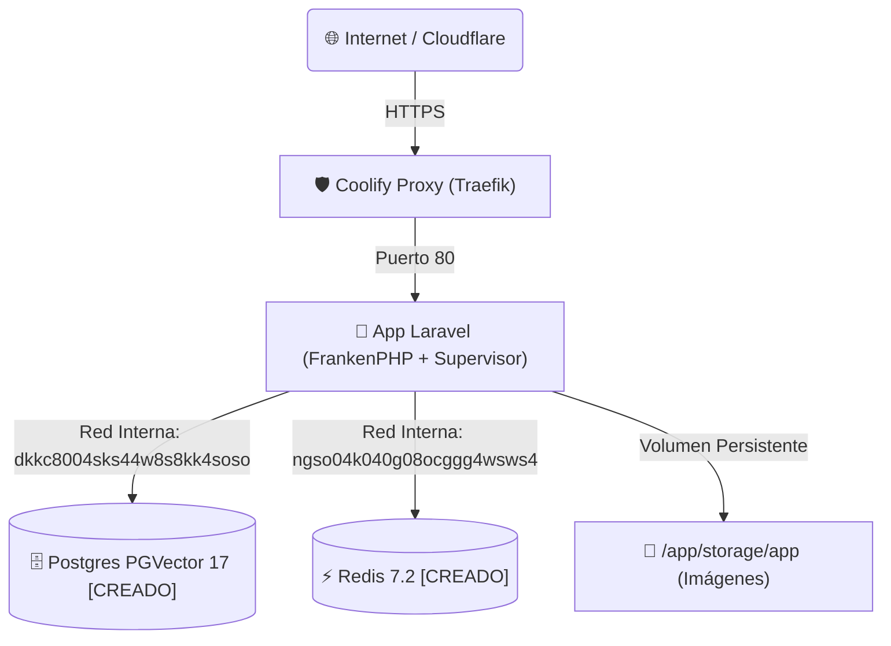

# Guía Definitiva de Despliegue en Coolify v4 (Glodaxia News)

Guía personalizada paso a paso, directa al grano y adaptada a los recursos reales creados en tu Coolify v4.

---

## 🏗️ Estado Actual de Recursos en Coolify



---

## ✅ PASO 1: PostgreSQL 17 + PGVector (✔️ Ya Creado en Coolify)

Tu base de datos ya está activa en Coolify con estos parámetros:
* **Recurso**: `postgresql-database-dkkc8004sks44w8s8kk4soso`
* **Host Interno (`DB_HOST`)**: `dkkc8004sks44w8s8kk4soso`
* **Puerto (`DB_PORT`)**: `5432`
* **Base de datos (`DB_DATABASE`)**: `postgres`
* **Usuario (`DB_USERNAME`)**: `postgres`
* **Contraseña (`DB_PASSWORD`)**: `EX8yqyx4jBpds5PkXPacMjAt8h9GkecpKA7ikM91oddwUU6A98tzq0ftFSWSYtkM`
* **Puerto Externo / Port Mapping**: `3000` *(para conexión externa con DBeaver o psql)*

---

## ✅ PASO 2: Redis 7.2 (✔️ Ya Creado en Coolify)

Tu servidor Redis ya está activo en Coolify con estos parámetros:
* **Recurso**: `redis-database-ngso04k040g08ocggg4wsws4`
* **Host Interno (`REDIS_HOST`)**: `ngso04k040g08ocggg4wsws4`
* **Puerto (`REDIS_PORT`)**: `6379`
* **Contraseña (`REDIS_PASSWORD`)**: `uXvERZI3cTnYIHZeM6jlEug0ZIGxZv72Bx7ThrV6HNJG91q9Ix55LIVWzptNIXnu`

---

## 📦 PASO 3: Exportar tu Base de Datos Local e Importarla en Coolify

Para llevarte todas tus noticias redactadas, imágenes, usuarios y configuraciones a producción:

### 3.1 Exportar desde tu PC Local (1 solo comando):
En tu terminal de desarrollo en Windows/WSL, ejecuta:
```bash
cd /home/luisf/news
docker compose exec -T postgres pg_dump -U noticias noticias > backup_glodaxia.sql
```
*(Esto generará el archivo `backup_glodaxia.sql` con todos los datos exactos)*.

### 3.2 Importar a Coolify:
Tienes dos formas sencillas de importar el archivo `backup_glodaxia.sql` a Coolify:

* **Opción A (Con cliente GUI como DBeaver / TablePlus / pgAdmin)**:
  1. Conéctate a: `Host: IP_DE_TU_VPS`, `Port: 3000`, `Database: postgres`, `User: postgres`, `Password: EX8yqyx4jBpds5PkXPacMjAt8h9GkecpKA7ikM91oddwUU6A98tzq0ftFSWSYtkM`.
  2. Abre el script `backup_glodaxia.sql` y ejecútalo.

* **Opción B (Por consola psql en 1 línea)**:
  ```bash
  PGPASSWORD="EX8yqyx4jBpds5PkXPacMjAt8h9GkecpKA7ikM91oddwUU6A98tzq0ftFSWSYtkM" psql -h IP_DE_TU_VPS -p 3000 -U postgres -d postgres < backup_glodaxia.sql
  ```

---

## 🚀 PASO 4: Crear el Recurso de la App Laravel desde GitHub

1. En Coolify, ve a tu proyecto y haz clic en **+ New Resource** ➔ **Public / Private Git Repository**.
2. Selecciona tu cuenta de GitHub y el repositorio privado `funcion/news` (rama `master`).
3. **Build Pack**: Selecciona estrictamente **Dockerfile** (Coolify usará el `Dockerfile` optimizado en la raíz).
4. **General Settings**:
   * **Resource Name**: `glodaxia-app`
   * **Domains (FQDN)**: `https://glodaxia.com, https://www.glodaxia.com`
   * **Port Expose**: `80`

---

## 💾 PASO 5: Configurar el Volumen Persistente (Imágenes de Noticias)

En la configuración de **glodaxia-app** en Coolify:
1. Ve a la pestaña **Storages** (o *Persistent Storage*).
2. Haz clic en **+ Add Storage**:
   * **Volume Name**: `glodaxia_storage`
   * **Mount Path**: `/app/storage/app`
3. Guarda los cambios.

---

## 🔑 PASO 6: Variables de Entorno (Copiar y Pegar)

En la pestaña **Environment Variables** de **glodaxia-app** en Coolify, pega este bloque completo que ya tiene tus credenciales enlazadas:

```dotenv
APP_NAME="Glodaxia News"
APP_ENV=production
APP_KEY=base64:qyTzi6gpy0/bx/cAXudSRbrN8d4I5zvtNacLmgcid88=
APP_DEBUG=false
APP_URL=https://glodaxia.com
ASSET_URL=https://glodaxia.com

LOG_CHANNEL=daily
LOG_LEVEL=error

# --- CONEXIÓN POSTGRESQL COOLIFY (Ya enlazada) ---
DB_CONNECTION=pgsql
DB_HOST=dkkc8004sks44w8s8kk4soso
DB_PORT=5432
DB_DATABASE=postgres
DB_USERNAME=postgres
DB_PASSWORD=EX8yqyx4jBpds5PkXPacMjAt8h9GkecpKA7ikM91oddwUU6A98tzq0ftFSWSYtkM

# --- CONEXIÓN REDIS COOLIFY (Ya enlazada) ---
REDIS_HOST=ngso04k040g08ocggg4wsws4
REDIS_PASSWORD=uXvERZI3cTnYIHZeM6jlEug0ZIGxZv72Bx7ThrV6HNJG91q9Ix55LIVWzptNIXnu
REDIS_PORT=6379

CACHE_STORE=redis
SESSION_DRIVER=redis
QUEUE_CONNECTION=redis

# --- APIS DE INTELIGENCIA ARTIFICIAL ---
DEEPSEEK_API_KEY=tu_clave_de_deepseek
SILICONFLOW_API_KEY=tu_clave_de_siliconflow
SILICONFLOW_IMAGE_MODEL=black-forest-labs/FLUX.1-schnell

# --- INDEXNOW (Bing / Yandex / Copilot / ChatGPT Search) ---
INDEXNOW_KEY=e9a4f781c03d42bfa168925bc01e4a77

# --- CORREO TRANSACCIONAL (SMTP) ---
MAIL_MAILER=smtp
MAIL_HOST=smtp.resend.com
MAIL_PORT=465
MAIL_USERNAME=resend
MAIL_PASSWORD=re_tu_api_key
MAIL_ENCRYPTION=tls
MAIL_FROM_ADDRESS="noticias@glodaxia.com"
MAIL_FROM_NAME="Glodaxia News"
```

---

## 🚀 PASO 7: Desplegar

1. Haz clic en el botón **Deploy** en la esquina superior derecha de Coolify.
2. Coolify construirá la imagen con FrankenPHP, compilará Vite, montará el almacenamiento persistente y levantará la web con HTTPS automático.

---

## ✨ ¿Qué pasa después en cada `git push`?

Cada vez que hagas un `git push origin master`:
* Coolify detectará el commit mediante la GitHub App.
* Reconstruirá la imagen de la App en segundo plano.
* Tu base de datos Postgres y Redis **siguen vivas sin reinicios**.
* Tus imágenes y noticias **se mantienen 100% intactas**.
