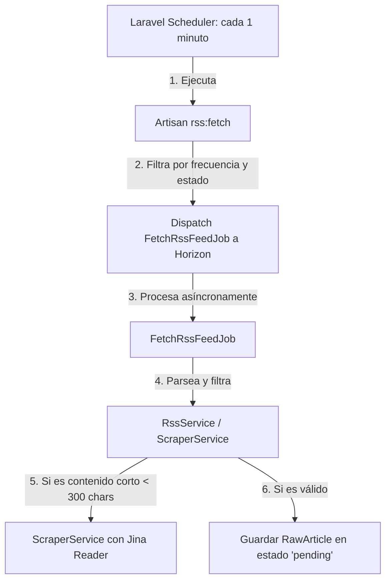

# Referencia Técnica: Pipeline de Ingesta Completo (RSS, Atom y Scraping)

Este documento describe detalladamente la lógica, la arquitectura y las reglas de negocio aplicadas al pipeline de ingesta de noticias en Glodaxia, desde la programación del scheduler hasta el guardado de noticias crudas en la base de datos.

---

## 1. Arquitectura General del Pipeline

El pipeline de ingesta se divide en cuatro capas diseñadas para garantizar la asincronía, el control de frecuencia por fuente y la de-duplicación de contenidos:



---

## 2. Capa 1: Planificación Temporal (Scheduler)

La ingesta se inicia automáticamente en segundo plano gracias al planificador de tareas de Laravel (`routes/console.php`).

*   **Comando programado:** `rss:fetch`
*   **Frecuencia:** Cada minuto (`everyMinute()`)
*   **Ejecución en producción:** Gestionado por el demonio del scheduler en el contenedor (`php artisan schedule:run` o cron).

### 2.1 Ejecución y Pruebas Manuales (Docker)
Puedes ejecutar este comando manualmente para probar la ingesta sin esperar al planificador:

```bash
# Ejecución estándar (respeta la frecuencia de actualización de cada fuente)
docker compose exec app php artisan rss:fetch

# Ejecución forzada (ignora las frecuencias y consulta todas las fuentes activas inmediatamente)
docker compose exec app php artisan rss:fetch --force
```

---

## 3. Capa 2: Selección y Despacho (`RssFetchCommand`)

El comando `RssFetchCommand` (ubicado en `app/Console/Commands/RssFetchCommand.php`) determina qué fuentes deben consultarse en la ejecución actual.

### 3.1 Reglas de Selección
El comando consulta la base de datos filtrando los registros de la tabla `sources` que cumplan las siguientes condiciones:
1.  **Estado Activo:** La fuente debe tener `is_active = true`.
2.  **Frecuencia Alcanzada:** El tiempo transcurrido desde la última consulta (`last_fetched_at`) debe ser igual o superior a la frecuencia configurada en minutos (`frequency`).
    *   *Fórmula SQL:* `last_fetched_at + (frequency * interval '1 minute') <= NOW()`
    *   *Excepción:* Si se ejecuta con el flag `--force`, se omiten estas comprobaciones y se consultan todas las fuentes activas.

### 3.2 Despacho Asíncrono
Para cada fuente seleccionada, el comando despacha un Job a la cola de Redis gestionada por Horizon:
```php
FetchRssFeedJob::dispatch($source);
```

---

## 4. Capa 3: Ejecución en Segundo Plano (`FetchRssFeedJob`)

El Job `FetchRssFeedJob` (ubicado en `app/Jobs/FetchRssFeedJob.php`) se encarga de aislar la carga de red y el consumo de CPU de la consulta.

### 4.1 Resiliencia y Control de Errores
*   **Reintentos:** El Job está configurado para reintentarse hasta **3 veces** en caso de caídas de conexión o fallos temporales del servidor de origen.
*   **Chequeo Rápido (Fail-Fast):** Al arrancar el Job, verifica que la fuente siga estando activa en la base de datos. Si un administrador la desactivó mientras el Job estaba en cola, este aborta inmediatamente sin consumir recursos de red.
*   **Penalización de Fuentes:** Si la descarga del feed falla repetidamente tras los reintentos, el sistema captura la excepción, decrementa el campo `score` de la fuente en **-1 punto** (para auditoría de fiabilidad) y escala el error a los logs.

---

## 5. Capa 4: Descarga, Parseo y Filtros de Ingesta (`RssService`)

El servicio `RssService` (ubicado en `app/Services/RssService.php`) es el núcleo del pipeline de ingesta y aplica múltiples filtros de calidad y de-duplicación.

### 5.1 Parseo de Canales RSS/Atom
*   Utiliza la librería **SimplePie** configurada para almacenar en caché local los feeds y optimizar el consumo de ancho de banda.
*   **Filtro especial de GitHub Releases (Atom):** Si la URL proviene de GitHub, el servicio filtra los tags de desarrollo (`alpha`, `dev`, `pre`, `test`) y pre-releases (`rc`, `beta`) para quedarse únicamente con las versiones estables y los releases candidates más nuevos.

### 5.2 Filtros de Calidad de Ingesta
Antes de guardar cualquier artículo del feed, se aplican los siguientes filtros en cascada:

1.  **Filtro de Antigüedad Dinámica (`max_age_days`):**
    El servicio calcula el límite de tiempo permitido utilizando la configuración específica de la fuente. Si el artículo en el feed tiene una fecha de publicación anterior, se descarta:
    ```php
    $maxAgeSeconds = ($source->max_age_days ?? 1) * 24 * 3600;
    $thresholdTime = time() - $maxAgeSeconds;
    if ($timestamp && $timestamp < $thresholdTime) {
        continue; // Descarta la noticia obsoleta
    }
    ```
2.  **De-duplicación de Noticia Cruda (Hash Único):**
    Para evitar almacenar noticias repetidas si el feed reordena sus elementos, se calcula un hash SHA256 único a partir del título y la URL del artículo. Si ya existe un registro con el mismo hash en la tabla `raw_articles`, se ignora:
    ```php
    $hash = hash('sha256', $title . $url);
    if (RawArticle::where('hash', $hash)->exists()) {
        continue;
    }
    ```

### 5.3 Web Scraping de Respaldo (Jina Reader)
Muchos portales de noticias configuran sus feeds RSS para que solo muestren un resumen recortado del artículo en lugar del texto completo.
*   **Gatillador:** Si el texto limpio (`strip_tags`) del contenido del feed tiene **menos de 300 caracteres**, se considera incompleto.
*   **Acción:** El sistema invoca al servicio `ScraperService` enviando la URL del post original a la API de **Jina Reader** (`https://r.jina.ai/`).
*   Jina se encarga de realizar el renderizado de la web, remover los anuncios, menús de navegación lateral y scripts, y devuelve el artículo limpio en formato Markdown, el cual se guarda en lugar del texto recortado del RSS.

### 5.4 Registro en Base de Datos
Si el artículo pasa todos los filtros, se inserta en la tabla `raw_articles` con:
*   `status` = `'pending'` (Listo para que lo tome el procesador de IA).
*   Metadatos del feed original (categorías externas, ID único de feed, autor original).
*   Enlace de la imagen destacada (si viene adjunta en la etiqueta `enclosure` del feed).
