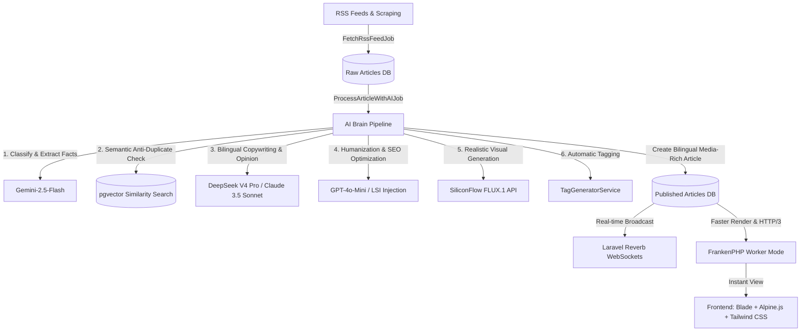
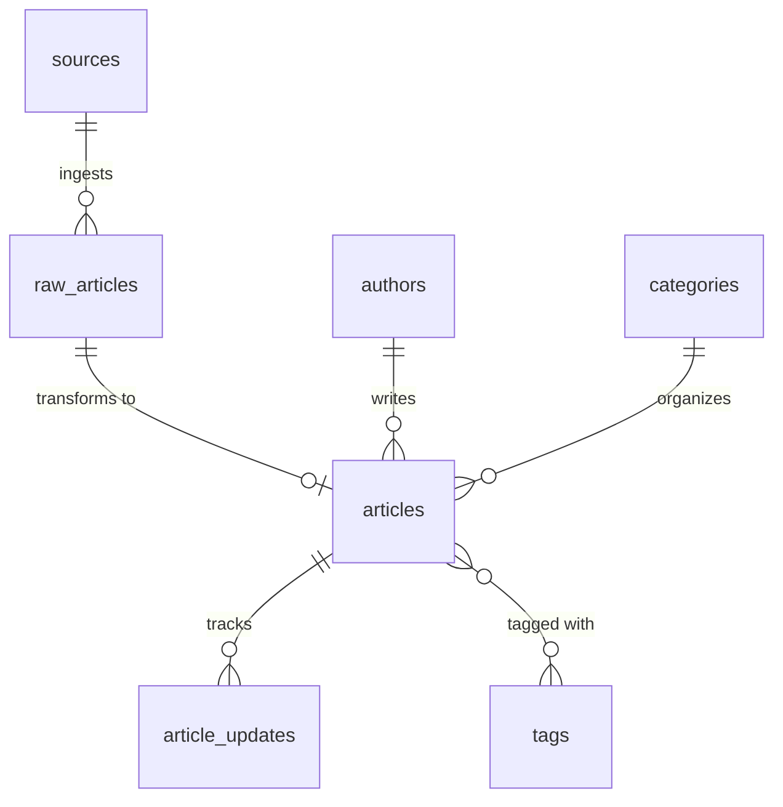

# 🗞️ Glodaxia Project Analysis - Premium AI-Powered Bilingual News Platform

Welcome to the definitive architecture and analysis document for **Glodaxia: Tech & News Magazine**. This document serves as a persistent "memory card" and developmental blueprint for our team as we continue to build, optimize, and scale this automated, state-of-the-art news engine.

---

## 🏗️ 1. Architecture Overview & Tech Stack

Glodaxia is designed as a highly optimized, asynchronous, and scalable bilingual publication system. The underlying core emphasizes minimal latency, technical SEO excellence, and fluid real-time interactions.



### 🛠️ Technical Stack Breakdown

| Layer | Technology | Operational Function |
| :--- | :--- | :--- |
| **Web Server / Runtime** | **FrankenPHP** (PHP 8.3 + Caddy) | Replaces traditional Nginx + PHP-FPM. Enables Worker Mode (app persistent in memory like Octane), HTTP/3 QUIC, Brotli/Zstd compression, and Server Push. |
| **Core Framework** | **Laravel 12** | Core backend logic, routing, service providers, and database abstraction. |
| **Admin Dashboard** | **Filament v3** | Premium backoffice for manual review, editor curation, and settings administration. |
| **Database** | **PostgreSQL + pgvector** | Core persistence. `pgvector` enables fast cosine distance (<=>) queries for semantic duplicate checking. |
| **Caching & Queues** | **Redis + Laravel Horizon** | Caching, session storage, and Horizon dashboard to process heavy AI and visual generation tasks in the background. |
| **WebSockets** | **Laravel Reverb** | Real-time notifications for live updates when new articles are published without reloading the page. |
| **Frontend** | **Blade + Alpine.js + Tailwind CSS** | Server-side rendering (SSR) for perfect SEO indexation combined with lightweight Alpine.js reactivity and standard accessibility hooks. |
| **AI Translation** | **Spatie Laravel Translatable** | Handles multi-language (`en` and `es`) columns dynamically within JSONB database structures. |
| **Media Engine** | **Spatie MediaLibrary + Intervention** | Responsive image conversions, WebP encoding, bilingually matched alt text, and SEO filenames. |

---

## 🗄️ 2. Database Schema & Core Models

Glodaxia organizes data in a structured, multi-tier database designed for bilingual access and high performance.



### 🗃️ Key Tables and Column Formats

#### 1. `articles`
Contains both locale-specific properties (handled dynamically via JSONB) and absolute metadata.
*   `id` (BigInt, PK)
*   `slug_en`, `slug_es` (VARCHAR(255), unique) — Independent URLs for perfect English and Spanish SEO.
*   `title` (JSONB) — Translatable title: `{"en": "...", "es": "..."}`
*   `content` (JSONB) — Translatable HTML content.
*   `excerpt` (JSONB) — Translatable teasers/meta-descriptions.
*   `meta_title`, `meta_description`, `image_alt` (JSONB)
*   `image_url` (VARCHAR(255)) — Hero/featured image path.
*   `embedding` (Vector, 1536 dimensions) — For pgvector semantic lookup.
*   `status` (VARCHAR) — `draft`, `published`, `pending_review`, `rejected`.
*   `views` (Integer)
*   `published_at` (Timestamp)

#### 2. `raw_articles`
Temporary storage to stage incoming feeds before ingestion or dismissal.
*   `id`, `source_id`
*   `title`, `content` (TEXT, raw)
*   `url` (VARCHAR, unique raw hash target)
*   `status` (VARCHAR: `pending`, `processed`, `ignored`, `failed`)

#### 3. `tags`
*   `id`
*   `name` (JSONB) — Translatable tag names.
*   `slug` (VARCHAR, unique)
*   `article_count` (Integer, cached for query speed)

#### 4. `article_updates`
Appends additional news coverage to a single article URL to prevent keyword cannibalization and trigger IndexNow fresh content signals.
*   `id`, `article_id`, `raw_article_id`, `url`, `added_at`

---

## 🧠 3. The AI Processing Pipeline ("The Brain")

Processing incoming news is executed as a background worker pipeline via Horizon within `ProcessArticleWithAIJob.php`. 

### 1. Ingestion & Polling (`FetchRssFeedJob` + `RssService`)
*   Regular cron pulls active RSS configurations.
*   Raw content is parsed and validated, then stored as `pending` inside `raw_articles`.

### 2. Classification & Fact Extraction (`Gemini-2.5-Flash`)
*   An ultra-fast prompt detects the source language.
*   Extracts key facts as a concise list (translated directly to English for consistency).
*   Validates if the content fits categories, flagging non-relevant items as `ignored`.

### 3. Anti-Duplicate Matrix (`DuplicateCheckerService`)
To prevent Google spam penalties and maintain a clean layout, three levels of duplicate checking are enforced:
*   **Level 1 (Exact Hash)**: Checks unique URLs/titles.
*   **Level 2 (Text Similarity)**: Checks database titles for fuzzy similarity.
*   **Level 3 (Semantic pgvector)**: Converts the new article to a 1536-dim embedding vector via `text-embedding-3-small` and queries:
    ```sql
    SELECT id, (embedding <=> ?::vector) as distance FROM articles WHERE embedding IS NOT NULL ORDER BY distance LIMIT 1
    ```
    *   If **distance < 0.15** (extremely high semantic similarity), the article is flagged as a duplicate.
    *   Instead of creating a new article, it appends the new link as a structured `ArticleUpdate` and bumps `updated_at`, alerting Google via **IndexNow** of fresh coverage.

### 4. Bilingual Copywriting & Opinion Column Voice
The core copywriting model is **DeepSeek V4 Pro** (fallback: Claude 3.5 Sonnet) configured through `OpenRouterService`. It implements an opinion-column style modeled after TechCrunch or Wired:
*   **Irresistible Curiosity Gap**: Compelling headers and punchy hooks.
*   **Strong Editorial Thesis**: The writer adopts a specific, expert point of view (skeptical, excited, urgent). No robotic fence-straddling.
*   **Organic Rhythm (Burstiness)**: Handcrafted sentence variation (mix of short 5-word punches and structured complex thoughts).
*   **AI Vocabulary Filter**: Strictly blocks machine fingerprints such as *"paradigm shift"*, *"revolutionary"*, *"democratization"*, *"seamlessly integrate"*, *"in conclusion"*, or *"robust ecosystem"*.

### 5. Media & Alt Generation (`SiliconFlowImageService`)
*   Fetches 1 custom photorealistic prompt generated by the writing pipeline from the **SiliconFlow FLUX.1-schnell** API.
*   Downloads the image, resizes it to `1280x720` (WebP, quality 85) using libvips/Intervention.
*   Uses Spatie MediaLibrary to create a dual-language asset mapping:
    *   Saves a copy into `images_en` with English alt tags, titles, and SEO filenames (`{slug-en}-1.webp`).
    *   Saves a copy into `images_es` with Spanish counterparts (`{slug-es}-1.webp`).
*   Embeds semantic, WCAG-compliant HTML `<figure>` wrappers:
    ```html
    <figure role="group" aria-labelledby="caption-img-id" class="article-image my-10 overflow-hidden rounded-xl border border-gray-100 shadow-2xl">
        
        <figcaption id="caption-img-id" class="text-sm text-gray-500 mt-4 text-center italic bg-gray-50/50 py-3 border-t">
            Engaging image caption
        </figcaption>
    </figure>
    ```

### 6. Automatic Tag Syncing (`TagGeneratorService`)
*   Extracts key technological terms and concepts.
*   Normalizes slugs, filters stopwords, and syncs via Spatie Translatable formats.

---

## 🎨 4. Frontend & Responsive UI/UX Systems

The Glodaxia frontend implements a sleek, high-end "Tech Magazine" design with strict accessibility standards (ADA/WCAG 2.1 AA compliant).

### 📐 2-Column Responsive Layout
*   **Main Column (70%)**: Houses the dynamic grid of articles, styled with subtle hover transitions and modern border radii (`rounded-lg`).
*   **Sidebar Column (30%)**: Features popular tags, trending news, newsletter forms, and future monetization blocks.
*   **Mobile view**: Collapses natively into a single reading column.

### 🌗 Theme Compatibility (Dark/Light)
The interface features full dark and light mode coverage via a manual toggle saved in `localStorage` and respecting OS `prefers-color-scheme`. Contrast constraints adhere to a **minimum of 4.5:1 (WCAG AA)**:

| Element | Light Mode Color Specification | Dark Mode Color Specification |
| :--- | :--- | :--- |
| **Main Background** | `bg-slate-50` / `bg-white` | `bg-slate-950` / `bg-slate-900` |
| **Primary Text** | `text-slate-800` / `text-slate-900` | `text-slate-100` / `text-slate-200` |
| **Secondary Text** | `text-slate-600` (Improved visibility) | `text-slate-400` |
| **Borders** | `border-slate-200` | `border-white/5` |
| **Accent Text** | `text-cyan-600` (Accessible contrast) | `text-cyan-400` |

### 🌐 Multilingual Navigation & Language Flags
URLs are kept clean and locale-aware using the `Mcamara/LaravelLocalization` middleware:
*   English (Default): `/news/my-article-slug`
*   Spanish: `/es/noticias/mi-articulo-slug`

To maintain absolute independence from third-party graphics, the language toggles are rendered using **pure CSS premium flags**:
*   **USA Flag**: CSS layout displaying 7 precise red and white stripes, overlaying a dark blue background container simulating a clean field of stars.
*   **Spain Flag**: Proportional 3-stripe red-yellow-red CSS block (2:1:2 ratio).

### ♿ Accessibility & Stability Rules
1.  **Header stability (The Two-Child Rule)**: The `justify-between` header bar contains exactly two children: the **Logo** and a **Unified Container** wrapping the Navigation and Action buttons. This surgical layout prevents elements from wrapping onto new lines or shifting under tablet resolutions.
2.  **Native SVGs**: Responsive navigation bars avoid fragile custom animations or layout-shifting elements. It uses standard SVG icons styled with Alpine.js toggles (`x-show` and `:aria-expanded`).
3.  **Keyboard Traps & Skip Links**: Built-in keyboard navigation allows full accessibility using standard Skip Links for screen readers.

---

## 🚀 5. Production Optimization & Deployment

For a lightning-fast response time (**TTFB < 50ms**), our production setup relies on advanced FrankenPHP server optimization:

```ini
; php.ini Production Settings
memory_limit = 512M
opcache.enable = 1
opcache.memory_consumption = 256
opcache.jit_buffer_size = 256M
realpath_cache_size = 4096K
realpath_cache_ttl = 600
```

### 🐋 Docker Compose & Worker Setup
*   **FrankenPHP Worker Mode**: Keeps the Laravel application boot sequence in memory, multiplying throughput.
*   **Horizontal Scaling**: Scaled replicas behind a unified Caddy load balancer using full HTTP/3 over QUIC protocols.

---

## 🔮 6. Development Roadmap & Next Steps

Glodaxia's core foundation is solid and fully operational. Below is our ongoing checklist to perfect the system:

- [x] Integrate Spatie Translatable database migration.
- [x] Configure dual Spatie MediaLibrary collections (`images_en`/`images_es`).
- [x] Implement pgvector Semantic Distance checks.
- [x] Refine responsive accessible header layout (2-child container structure).
- [x] Build pure CSS flags for bilingual switches.
- [ ] Build beautiful dynamic individual tag cloud views.
- [ ] Configure automatic RSS publisher feeds.
- [ ] Set up Prometheus dashboard mapping `/metrics` from FrankenPHP.
- [ ] Implement self-hosted n8n/Docker workflows to auto-publish updates to Telegram and Discord.

---

> [!NOTE]
> This analysis is now locked as our permanent workspace context. Use this layout, naming conventions, and constraints whenever performing edits or designing new features on **Glodaxia**.
